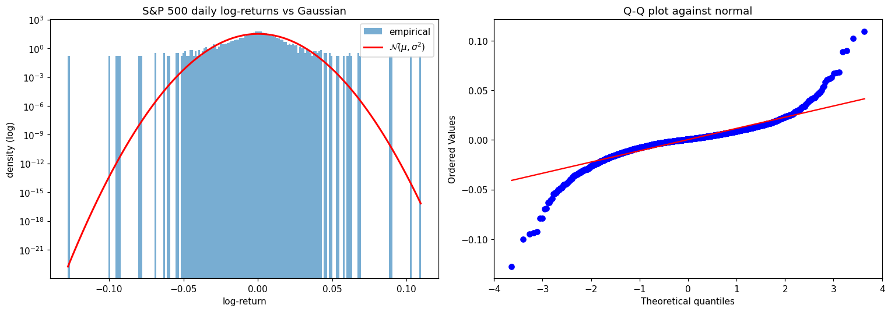

# 模块 1 · 学科诞生 —— 物理学家为何进入金融

> "Economics needs a scientific revolution."
> —— Jean-Philippe Bouchaud, *Nature* 455, 1181 (2008)

这一模块不教任何具体技术。它只做一件事:**让你理解一群训练有素的物理学家为什么会觉得有必要重起炉灶,把金融市场当成自己的研究对象**。

如果你跳过这一模块直奔后面的 power law、RMT、ABM,你会在某个时刻问自己一个尴尬的问题:经济学家自己已经有一套完整的理论框架,物理学家凭什么觉得自己的工具更合适?这一模块就回答这个问题——而且回答它,你得先知道金融学最核心的数学结构本来就是物理学的语言。

读完本模块后,你应该能:

1. 用一两句话解释什么是 econophysics、它和金融经济学的关系
2. 复述至少 3 位关键人物的贡献,并说出大致年代
3. 说出物理学家与主流金融经济学家在方法论上的核心分歧
4. 用 Python 加载 S&P 500 的日收益数据,画出直方图和 Q-Q 图,**亲眼看到**正态分布在尾部的失败

---

## 1.1 史前史:Bachelier 1900 与被忽视的数学起点

故事的开头不在物理学家这一边,而在数学这一边。1900 年,Louis Bachelier 在巴黎答辩了一篇博士论文 *Théorie de la spéculation*,里面提出:股票价格的变动可以用今天我们称为 Brownian motion 的随机过程来描述。这比 Einstein 在 1905 年用 Brownian motion 解释花粉颗粒运动还**早了 5 年**。

Bachelier 的论文在数学和物理上都是先驱性的,但在 20 世纪上半叶被大体忽略了。一直到 1960 年代 Paul Samuelson 重新发现这篇论文,把它带回金融学的主流视野,才有了后来的 Black–Scholes–Merton 期权定价(1973)。**今天主流金融学的"价格 = 随机游走"这条基本假设,本质是 Bachelier 1900 年那篇论文的延伸。**

记住这一点:金融学最核心的数学结构,本来就是物理学的语言。物理学家进场,不是入侵,是回家。

---

## 1.2 转折:Mandelbrot 1963 与重尾的首次证据

Benoît Mandelbrot 是这个故事真正的搅局者。1963 年,他研究棉花价格的日变动数据时,发现一个尴尬的事实:

> 棉花价格收益率的分布**根本不是正态分布**。极端事件出现的频率比正态分布预测的高得多。

如果你假定收益率服从 $\mathcal{N}(\mu, \sigma^2)$,那么一个 6σ 的事件大约每 50 万年才发生一次。但 Mandelbrot 在棉花数据里看到,这种"百万年级"的事件每隔几年就来一次。

Mandelbrot 提出用 **Lévy 稳定分布(Lévy stable distribution)** 来描述收益率——这类分布允许"重尾(fat tails)"。这是经济物理学的真正起点:**用数据说话,而不是用方便性挑模型**。

主流经济学界基本对此选择了无视。Eugene Fama 在 1965 年的论文里承认了 Mandelbrot 的观察,但 Black–Scholes 公式照样基于正态假设。这种"知道有问题,但模型继续用"的态度,是后来物理学家不满的根源。

---

## 1.3 1990 年代:物理学家进场

冷战结束、苏联解体、超导超级对撞机(SSC)1993 年被取消——一大批训练有素的理论物理学家发现自己需要换饭碗。其中一部分人去了 Wall Street,另一部分人留在学界,但开始把统计物理的工具搬到金融数据上。

几个核心人物和团队值得记住:

- **H. Eugene Stanley**(波士顿大学):把临界现象、scaling laws、生物物理那一套工具带进金融数据分析。1990 年代他的团队是 econophysics 的旗舰之一。"econophysics" 这个词据说就是他在 1995 年左右的一场会议上创造的。<!-- TODO: 查证具体会议,常见说法是 1995 Kolkata -->
- **Jean-Philippe Bouchaud**(巴黎,后创办 Capital Fund Management):理论物理出身(disordered systems),后来把这一套用到价格冲击、订单簿、组合风险上,至今仍在产出。CFM 是少数公开发表学术论文的量化对冲基金。
- **Didier Sornette**(巴黎、UCLA、ETH Zürich):地球物理学家出身,把临界现象和 log-periodic oscillations 用于金融崩盘预测。他的方法有争议,但思路非常物理学家。
- **Rosario Mantegna & H. Eugene Stanley**:1999 年合著的 *An Introduction to Econophysics* 是这门学科的第一本教科书。

到 1990 年代末,已经有了固定的会议(如 Econophysics Colloquium)、专属期刊(如 *Quantitative Finance*<!-- TODO: 查证创刊年份,记忆中是 2001 -->)、以及专属术语。

---

## 1.4 方法论:物理学家 vs 金融经济学家

经济物理学和主流金融经济学之间的张力,**不是数学水平的问题**,而是方法论的问题。可以粗略地这样对比:

| 维度 | 主流金融经济学 | 经济物理学 |
|---|---|---|
| 出发点 | 公理(理性人、无套利、市场出清) | 数据(实证规律) |
| 模型角色 | 描述理性的均衡 | 描述涌现的统计规律 |
| 偏好的数学 | 优化、动态规划、Itô 微积分 | 统计物理、随机过程、复杂系统 |
| 对"异常"的态度 | 模型修补(加跳跃项、改测度) | 异常可能是核心,不是噪声 |
| 验证标准 | 内部一致性 + 部分实证 | 经验拟合 + 出样本预测 |

**关键差异在于"理论 vs 数据"的优先级**。物理学家受的训练是:当模型和数据不一致时,错的几乎肯定是模型。经济学家则更倾向于在模型框架内打补丁。这不是谁对谁错,是两种学科传统。

经济物理学家常被主流经济学家批评的几点(值得记住,因为有的批评是中肯的):

1. 经验规律拟合得很好,但**没有清晰的微观机制**——为什么会出现这个 power law?
2. 忽略制度因素(监管、央行政策、税收)的影响
3. 把市场过度类比为物理系统,但市场参与者会学习、适应,物理粒子不会

后面的模块里,我们会反复回到这三条批评,看 econophysics 这二十多年是怎么部分回应它们的。

---

## 1.5 实战:Python Lab —— 亲眼看到高斯失败

理论说得再多,不如打开数据看一眼。下面这段 Python 把 S&P 500 过去 20 年的日收益率画出来,叠加同方差的正态分布做参照。

```python
import numpy as np
import yfinance as yf
import matplotlib.pyplot as plt
from scipy import stats

# 下载 S&P 500 过去 20 年的日数据
spx = yf.download("^GSPC", start="2005-01-01", end="2025-01-01", auto_adjust=True)
returns = np.log(spx["Close"]).diff().dropna().values.flatten()

# 1. 直方图 vs 同方差正态
fig, axes = plt.subplots(1, 2, figsize=(14, 5))

mu, sigma = returns.mean(), returns.std()
x = np.linspace(returns.min(), returns.max(), 500)

axes[0].hist(returns, bins=200, density=True, alpha=0.6, label="empirical")
axes[0].plot(x, stats.norm.pdf(x, mu, sigma), "r-", lw=2, label=r"$\mathcal{N}(\mu, \sigma^2)$")
axes[0].set_yscale("log")  # 关键:log 尺度才看得到尾部
axes[0].set_title("S&P 500 daily log-returns vs Gaussian")
axes[0].set_xlabel("log-return"); axes[0].set_ylabel("density (log)")
axes[0].legend()

# 2. Q-Q plot —— 尾部对得齐就走直线
stats.probplot(returns, dist="norm", plot=axes[1])
axes[1].set_title("Q-Q plot against normal")

plt.tight_layout()
plt.show()
```

跑出来的结果(已附在仓库 `scripts/m01.py`):

```text
n_obs = 5032
mu = 0.000316, sigma = 0.012103
min = -0.1277, max = 0.1096
sample kurtosis = 13.03  (Gaussian excess kurtosis = 0)
#|r|>4σ = 36   Gaussian expectation ≈ 0.32
```



两张图就把"高斯不够用"讲清楚了:

- **直方图(左)**:在 log 尺度下,正态分布的红线在尾部"垂直下落",但实际数据像两条慢慢倾斜的直线——这就是 power-law 尾部的视觉特征
- **Q-Q plot(右)**:在两端明显**偏离 45° 线**,向外弯出去——经验分布的极端值比正态分布预测的"严重得多"
- **数字层面**:样本峰度 13.0(高斯是 0);4σ 以外的事件出现了 36 次,而高斯只允许约 0.32 次——把"百年一遇"变成"每年一遇"

这就是经济物理学的出发点:**正态分布不够用**。模块 2 我们会深入讨论该用什么。

---

## 1.6 常见误解

- **"经济物理学就是用复杂数学包装金融"**——恰恰相反,它常常用更简单但更贴合数据的模型替代精巧但脱离数据的模型
- **"物理学家不懂经济学"**——其中很多人非常懂,正是因为懂才不满意
- **"重尾 = 黑天鹅 = 不可预测"**——重尾**恰恰意味着极端事件比直觉中更可预测**,它们出现的频率有规律
- **"econophysics 已经失败"**——它没成为主流金融经济学的替代品,但它的工具(power law、impact law、RMT 去噪等)今天在 quant 业界广泛使用

---

## 1.7 章末小结与延伸

### 本模块核心回顾

1. **金融学的数学起点在物理学这边**:Bachelier 1900 年比 Einstein 早 5 年提出 Brownian motion 的金融应用,今天主流金融学的"价格 = 随机游走"是这条思路的延伸
2. **Mandelbrot 1963 年首次给出经验证据**:收益率根本不是正态分布,极端事件多得多——但主流金融学知道这点之后,选择"模型继续用"
3. **1990 年代物理学家进场**:Stanley、Bouchaud、Sornette 等人把统计物理、临界现象、复杂系统的工具搬进金融数据分析,1999 年 Mantegna & Stanley 教科书把学科形态固定下来
4. **方法论的真正分歧不在数学,在优先级**:物理学家"数据 > 模型",经济学家"模型框架内修补";两种学科传统,各有合理批评
5. **入门动作**:打开 S&P 500 数据,在 log 尺度画一遍直方图和 Q-Q plot,亲眼看到高斯尾部的失败——这是本学科所有后续讨论的出发点

### 习题

#### 习题 1.1(简单)

为什么 Bachelier 的论文在 20 世纪上半叶被忽略,却在 1960 年代被重新发现?用 2-3 句话说清楚两个时代的差异。

#### 习题 1.2(简单)

Mandelbrot 1963 年的论文在数学上提出了什么具体的替代模型?用一句话说出名字,再用一句话说它和正态分布的关键差异。

#### 习题 1.3(中等)

用一句话解释"重尾(fat tails)"是什么意思,以及它为什么对风险管理重要。然后再用一句话说:为什么"重尾"和"完全不可预测"是两回事?

#### 习题 1.4(开放,无标准答案)

经济物理学家批评主流金融经济学的"理论优先于数据",反过来主流经济学家又怎样批评经济物理学?在 1.4 节列的三条批评里,你觉得哪一条最有杀伤力?为什么?

#### 习题 1.5(中等,需跑代码)

跑 1.5 节那段 Python lab。在你跑出来的 Q-Q plot 里:

- 正负两端哪一边偏离正态更明显?
- 这意味着什么?(提示:想想下行风险 vs 上行风险)
- 把时间窗从 2005–2025 改成 1990–2010,结论会不一样吗?为什么?

### 延伸阅读

**必读:**

- Mantegna, R. N., & Stanley, H. E. (1999). *An Introduction to Econophysics*. Cambridge University Press. —— 这门学科的第一本教科书,导论章节就够。
- Bouchaud, J.-P. (2008). "Economics needs a scientific revolution." *Nature*, 455, 1181. —— 短文,1 页,立场鲜明。

**值得翻:**

- Mandelbrot, B. (1963). "The variation of certain speculative prices." *Journal of Business*, 36(4), 394–419. —— 起点论文。
- Ball, P. (2004). *Critical Mass*. —— 科普读物,把统计物理和社会系统连起来的最佳入门。

**进阶(暂时跳过也可以):**

- Sornette, D. (2003). *Why Stock Markets Crash*. —— Sornette 的临界现象视角,将在模块 5 用到。
- Bouchaud, J.-P., & Potters, M. (2003). *Theory of Financial Risk and Derivative Pricing* (2nd ed.). —— 工业级参考书,模块 4、6 会反复用到。

---

### 下一模块预告

模块 2 我们正式拆解"高斯不够用"这件事。Mandelbrot 提出 Lévy 稳定分布只是替代方案之一,实证上看到的"重尾"更像 power-law 尾部 + 有限方差的混合体,而 CLT 之所以"失效",本质是收益率的产生机制并不满足 CLT 的前提。我们会讨论怎么用 Hill 估计、log-log 回归这些标准工具量化尾指数,以及它们各自的坑。

---

> **本模块一句话总结**
>
> 经济物理学的存在理由,可以浓缩成一张图:S&P 500 收益率的 Q-Q plot 在两端向外弯出去。一旦你亲眼看过这张图,你就懂为什么物理学家觉得有必要重起炉灶。

---

## 📝 学习记录

| 项 | 内容 |
|---|---|
| 起始日期 | |
| 完成日期 | |
| 卡点(看不懂的概念 / 跑不通的代码 / 想不清楚的论证) | |
| 关键收获 | |
| 配套代码仓库链接 | |
