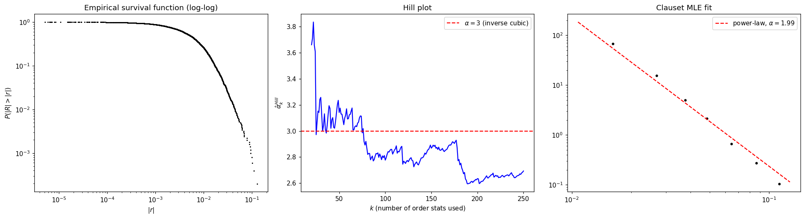

# 模块 2 · 重尾分布 —— 高斯不够用,那用什么

> "The variance of returns is, for all practical purposes, infinite."
> —— Benoît Mandelbrot, *The Variation of Certain Speculative Prices* (1963)
>
> "Actually, no. It's just very, very large — and that matters."
> —— Three decades of subsequent empirical work

模块 1 我们亲眼看到了 S&P 500 的 Q-Q 图在两端向外弯出去。这模块要做三件事:

1. **讲清楚 CLT 为什么没救回正态分布**——课本里那条"独立同分布求和趋向高斯"的定理,在金融收益率这里到底卡在哪一步
2. **把"重尾"这个直觉术语形式化**——power-law 尾、Lévy 稳定分布、Student-t、truncated Lévy 几种典型刻画,各自的内核和分歧
3. **教你做尾指数估计**——Hill 估计、log-log 回归怎么用,以及它们极容易出错的几个陷阱

读完本模块后,你应该能:

1. 用一句话说出 CLT 失效在金融数据里**最常见的两个真实原因**(不是教科书答案)
2. 解释 Lévy 稳定分布和"有限方差 + 幂律尾"这两种刻画的实证区别,以及为什么后者今天更主流
3. 用 Python 跑 Hill 估计,得到 S&P 500 的尾指数 $\alpha \approx 3$ 这个著名经验结果("inverse cubic law")
4. 知道**至少四个**常见的尾部估计陷阱,并能在自己跑代码时识别它们

---

## 2.1 为什么 CLT 没救回正态分布

经典的中心极限定理(Central Limit Theorem)说:**独立、同分布、方差有限**的随机变量,标准化后的和趋向标准正态。

如果一天的收益率是日内成千上万笔交易回报的累加,直觉上 CLT 应该把它"高斯化"才对。然而经验数据告诉我们它没有。问题出在 CLT 三个前提的每一个上,这里逐条拆。

### 2.1.1 前提一:独立 —— 收益率有长程相关

收益率本身的自相关确实接近零(否则你两小时就能把市场套利完)。但**收益率的绝对值** $|r_t|$ 和**平方** $r_t^2$ 的自相关在几十天甚至更长时间里都显著大于零。这就是模块 3 要展开的"波动率聚集(volatility clustering)"。

只要存在这种长程依赖,CLT 的经典形式就不再适用——需要 mixing 条件下的推广,而推广后的极限分布**未必是高斯**。

### 2.1.2 前提二:同分布 —— 市场状态会切换

牛市、熊市、危机期的收益率分布参数(尤其是方差)截然不同。把 2008-09 和 2017 放在一个样本里求"日收益率分布",本质是把多个分布混合(mixture)起来。**有限方差分布的混合,可以表现出重尾**——这是一个常被忽视的纯统计现象,不需要任何"真正"的幂律。

直觉:如果一半的天是 $\mathcal{N}(0, \sigma_1^2)$、另一半是 $\mathcal{N}(0, \sigma_2^2)$ 且 $\sigma_2 \gg \sigma_1$,合成分布的峰度会显著大于 3,看起来就像"重尾"。

### 2.1.3 前提三:方差有限 —— 这条争议最大

Mandelbrot 当年的主张是:**收益率分布的方差本来就是无穷的**,所以 CLT 根本不适用,极限分布应该是 Lévy 稳定族。

如果这是真的,那"年化波动率"这个量你算它就是耍流氓——样本方差会随样本增大不收敛。

后续几十年的经验证据基本判定 Mandelbrot **在这一点上过头了**:大量股票收益率的尾部更像 $P(|r| > x) \sim x^{-\alpha}$,其中 $\alpha \approx 3$。$\alpha > 2$ 意味着**方差有限**,只不过高阶矩(峰度、偏度的样本估计)非常不稳定。

这就引出"有限方差 + 幂律尾"这条今天更主流的范式。后面 2.3 节展开。

---

## 2.2 把"重尾"形式化:三个等价说法

"重尾"在不同文献里指三种相关但不完全等价的东西,先理清:

| 说法 | 形式定义 | 强度 |
|---|---|---|
| **峰度 > 3**(leptokurtic) | $\kappa = E[(X-\mu)^4]/\sigma^4 > 3$ | 最弱;Student-t、混合高斯都满足 |
| **次指数(subexponential)** | $\lim_{x\to\infty} \bar F(x) / e^{-\lambda x} = \infty$ | 中等;比任何指数衰减都慢 |
| **幂律尾(power-law / regularly varying)** | $\bar F(x) = P(X>x) \sim L(x) x^{-\alpha}$,$L$ 慢变 | 最强;包含 Pareto、Lévy stable、Student-t |

其中 $\bar F$ 是 **survival function**(也叫 complementary CDF)。下面所有讨论都聚焦在最严格的第三种:幂律尾。

幂律尾的关键参数是 **尾指数 $\alpha$**(也叫 tail exponent / tail index)。它决定了哪些矩存在:

$$
E[|X|^k] < \infty \iff k < \alpha
$$

所以:

- $\alpha \le 1$:均值不存在(Cauchy 是 $\alpha=1$ 的极端例子)
- $1 < \alpha \le 2$:均值存在,**方差无穷**(Lévy stable with $0<\alpha<2$ 落在这一档)
- $2 < \alpha \le 4$:方差存在,**峰度无穷**(股票收益率的典型档,$\alpha \approx 3$)
- $\alpha > 4$:前四阶矩都存在,接近"轻尾"行为

**为什么 $\alpha \approx 3$ 这么重要?** 因为它把股票收益率精准地放在"方差有限,但峰度无穷"这一档——你能算波动率,但算不准超额峰度,且任何"4 阶矩 / 5 阶矩"的策略都注定不稳定。后面 RMT(模块 4)和 ABM(模块 7)都会用到这条约束。

---

## 2.3 候选模型大比拼

### 2.3.1 Lévy 稳定分布(Mandelbrot 1963 的选择)

**定义**:稳定分布是满足"独立同分布之和再缩放后仍是同族"的分布。形式上,如果 $X_1, X_2 \stackrel{d}{=} X$,那么存在常数 $a_n, b_n$ 使得

$$
X_1 + X_2 + \cdots + X_n \stackrel{d}{=} a_n X + b_n
$$

正态分布是 $\alpha=2$ 的稳定分布(也是唯一方差有限的稳定分布)。当 $0 < \alpha < 2$ 时,Lévy 稳定分布有以下特征:

- 没有闭式 PDF(只有 Cauchy $\alpha=1$ 和 Lévy $\alpha=1/2$ 例外)
- 特征函数:$\varphi(t) = \exp(-|ct|^\alpha [1 - i\beta \operatorname{sgn}(t) \Phi])$,其中 $\beta \in [-1,1]$ 是偏度参数
- 尾部:$P(|X|>x) \sim C x^{-\alpha}$,$\alpha < 2$
- **方差无穷**

**优点**:它是"广义 CLT"的极限分布——独立同分布、尾指数 $\alpha$ 的变量求和,极限正是 $\alpha$-稳定分布。这是一个干净的理论闭包。

**缺点**:经验上股票收益率的 $\alpha$ 估计值在 3 附近,远大于 2,**根本不在 Lévy 稳定的取值范围里**。强行用 Lévy 稳定拟合,只能拟合中段,尾部反而拟得不好。

### 2.3.2 Truncated Lévy 与 inverse cubic law

Mantegna & Stanley(1994)提出 **截断 Lévy(truncated Lévy flight, TLF)**:在 Lévy 稳定的尾部加一个指数截断 $e^{-\lambda |x|}$。短时间尺度上看像 Lévy,长时间尺度上 CLT 会重新生效,极限是正态。

这个模型很巧妙,但后来的高频数据揭示:**真实的截断不是指数,而是更慢的幂律**,即

$$
P(|r|>x) \sim x^{-\alpha}, \quad \alpha \approx 3
$$

这就是 Gopikrishnan、Plerou、Stanley 等人在 1990 年代末用数千只股票、上百万笔 tick 数据验证的 **inverse cubic law**:股票收益率的尾部分布近似为 $-3$ 次幂。

**重要细节**:

- 个股、指数、不同时间尺度(从分钟到日)、不同市场(美股、欧股、新兴市场),$\alpha$ 都在 $3 \pm 0.5$ 附近
- 时间尺度从分钟拉长到月,$\alpha$ 会缓慢上升(尾部变轻),最终在月或季度尺度上接近高斯——但日尺度上 $\alpha \approx 3$ 是 robust 的

### 2.3.3 Student-t 与 GH 分布

实务里常用的不是 Lévy 稳定,而是 **Student-t 分布**(自由度 $\nu$ 对应尾指数 $\alpha = \nu$):

$$
f(x) = \frac{\Gamma\left(\frac{\nu+1}{2}\right)}{\sqrt{\nu\pi}\,\Gamma(\nu/2)} \left(1 + \frac{x^2}{\nu}\right)^{-(\nu+1)/2}
$$

$\nu \approx 3$ 时 Student-t 复现 inverse cubic law 的尾部,且方差有限(只要 $\nu > 2$)。比 Lévy 稳定**有闭式 PDF、可写似然、可估计**,所以在量化里几乎成了默认选择。

更一般的是 **广义双曲分布(Generalized Hyperbolic, GH)**,它把 Student-t、NIG、VG 等都收作特例,Eberlein & Keller 1995 之后在欧洲的衍生品定价社区里流行。我们这本书不展开 GH,但你应该知道它是 Student-t 的"工业化版本"。

### 2.3.4 谁赢了

| 模型 | 方差 | 尾指数 | 闭式 PDF | 经验拟合 | 当前地位 |
|---|---|---|---|---|---|
| 高斯 | 有限 | $\infty$ | ✅ | ❌(尾巴差太远) | 教科书基线 |
| Lévy 稳定($\alpha<2$) | ∞ | $\alpha<2$ | ❌ | ❌(经验 $\alpha\approx3$,超出范围) | 历史重要,现实少用 |
| Truncated Lévy | 有限 | 取决于截断 | ❌ | △(优于 Lévy stable) | 教学价值 |
| Student-t($\nu\approx3$) | 有限 | $\approx 3$ | ✅ | ✅ | 量化业界默认 |
| GH / NIG / VG | 有限 | 灵活 | △(特殊函数) | ✅ | 衍生品定价 |
| 纯经验 power-law fit | —— | 直接估 | —— | 取决于估计方法 | 学术研究 |

记一句话:**"有限方差 + 幂律尾"是 1990 年代末以后的共识,Lévy stable 在 1963 年是革命性的,今天主要是教学价值**。

---

## 2.4 怎么估计尾指数 $\alpha$

实战里几乎所有的尾部分析都归结到一个问题:**给定一堆样本,估出尾指数 $\alpha$**。三种主流方法:

### 2.4.1 log-log 回归(最朴素,最坑)

把样本按绝对值排序,用经验生存函数 $\hat{\bar F}(x_k) = k/n$($x_k$ 是第 $k$ 大的样本),取 log:

$$
\log \hat{\bar F}(x) = -\alpha \log x + c
$$

线性回归取负斜率作为 $\alpha$ 的估计。

**坑**:

1. 残差**完全不是独立同分布**——大值是少数,小值挤在一起,直接做 OLS 给出严重有偏的估计
2. 哪段算"尾"完全主观——你选不同的截断阈值,得到不同的 $\alpha$
3. 视觉上 log-log 直线"看起来挺直"是出名的不可靠的判断标准

**Clauset, Shalizi & Newman (2009)** 那篇著名论文专门痛批 log-log 回归滥用,推荐用 MLE + Kolmogorov-Smirnov 距离自动选阈值。我们后面 lab 里也会用它的方法。

### 2.4.2 Hill 估计(最常用)

固定一个阈值 $u$(或等价地,固定前 $k$ 大的样本),Hill 估计为:

$$
\hat\alpha_k^{Hill} = \left( \frac{1}{k} \sum_{i=1}^k \log \frac{X_{(i)}}{X_{(k+1)}} \right)^{-1}
$$

其中 $X_{(1)} \ge X_{(2)} \ge \cdots$ 是降序统计量。直觉上:幂律下 $\log X_{(i)} - \log X_{(k+1)}$ 服从指数分布,均值即 $1/\alpha$。

**优点**:在严格幂律下是 $\alpha$ 的最大似然估计,渐近正态,方差 $\alpha^2/k$。

**坑**:

1. **阈值 $k$ 的选择极度敏感**:$k$ 太大引入分布主体的偏差,$k$ 太小方差爆炸。常用对策是画 **Hill plot**(横轴 $k$,纵轴 $\hat\alpha_k$),找"平台区"
2. 对**慢变函数 $L(x)$** 的偏差不 robust——如果真实分布是 $L(x) x^{-\alpha}$ 而 $L$ 收敛慢,Hill 会系统性偏离 $\alpha$
3. 默认只看右尾,左尾要单独估(对收益率,通常左右两侧 $\alpha$ 接近但不严格相等)

### 2.4.3 MLE on Pareto tail above $x_{\min}$(Clauset et al. 推荐)

把模型设为"超过某阈值 $x_{\min}$ 后是纯 Pareto":

$$
P(X > x \mid X > x_{\min}) = \left(\frac{x}{x_{\min}}\right)^{-\alpha}, \quad x \ge x_{\min}
$$

MLE 给出:

$$
\hat\alpha = 1 + n_{\text{tail}} \left( \sum_{i: X_i \ge x_{\min}} \log \frac{X_i}{x_{\min}} \right)^{-1}
$$

形式上和 Hill 几乎一样(把 $x_{\min}$ 设为 $X_{(k+1)}$ 就完全等价)。区别在于 Clauset 等人**用 KS 距离自动选 $x_{\min}$**,而不是肉眼挑 Hill plot 的平台。Python 的 `powerlaw` 包就实现了这套流程。

### 2.4.4 三种方法的快速决策表

| 用途 | 推荐方法 |
|---|---|
| 教学演示、快速 sanity check | log-log 回归(知道它的偏倚) |
| 工业级、单次报告 | Clauset MLE + KS(`powerlaw` 包) |
| 学术发表、需要置信区间 | Hill + Hill plot,辅以 Bootstrap CI |
| 真的怀疑分布是不是 power-law | Clauset 的 likelihood-ratio 检验(对比 lognormal、stretched exponential) |

---

## 2.5 实战:Python Lab —— 估出 S&P 500 的 $\alpha$

下面这段代码做三件事:

1. 下载 S&P 500 日收益率,画**对数生存函数**(log-log)
2. 跑 **Hill plot**,找平台
3. 用 `powerlaw` 包做 Clauset MLE,得到 $\hat\alpha$ 和 $\hat x_{\min}$

```python
import numpy as np
import yfinance as yf
import matplotlib.pyplot as plt

# 下载数据
spx = yf.download("^GSPC", start="2005-01-01", end="2025-01-01", auto_adjust=True)
returns = np.log(spx["Close"]).diff().dropna().values.flatten()

# 左右两侧分别看(用绝对值,但左右分开会更细致;先合在一起)
abs_r = np.abs(returns)
abs_r_sorted = np.sort(abs_r)[::-1]   # 降序
n = len(abs_r_sorted)
ranks = np.arange(1, n + 1)
survival = ranks / n                   # 经验 P(|R| > x)

# --- 1. 对数生存函数 ---
fig, axes = plt.subplots(1, 3, figsize=(18, 5))

axes[0].loglog(abs_r_sorted, survival, "k.", ms=2)
axes[0].set_xlabel(r"$|r|$")
axes[0].set_ylabel(r"$P(|R| > |r|)$")
axes[0].set_title("Empirical survival function (log-log)")

# --- 2. Hill plot ---
def hill_estimator(sorted_desc, k):
    """sorted_desc: 降序样本; k: 取前 k 大算 Hill."""
    Xk1 = sorted_desc[k]
    return 1.0 / np.mean(np.log(sorted_desc[:k] / Xk1))

ks = np.arange(20, min(n // 20, 500))  # 别用太大的 k,会把主体吃进来
hill = np.array([hill_estimator(abs_r_sorted, k) for k in ks])

axes[1].plot(ks, hill, "b-")
axes[1].axhline(3, color="r", ls="--", label=r"$\alpha=3$ (inverse cubic)")
axes[1].set_xlabel(r"$k$ (number of order stats used)")
axes[1].set_ylabel(r"$\hat\alpha_k^{Hill}$")
axes[1].set_title("Hill plot")
axes[1].legend()

# --- 3. Clauset MLE ---
try:
    import powerlaw
    fit = powerlaw.Fit(abs_r, xmin=None, discrete=False, verbose=False)
    alpha_hat = fit.power_law.alpha   # 注意:powerlaw 的 alpha 是 1 + 我们的 alpha
    xmin_hat = fit.power_law.xmin
    print(f"Clauset MLE: alpha = {alpha_hat - 1:.2f}, xmin = {xmin_hat:.4f}")
    fit.plot_pdf(ax=axes[2], color="k", marker=".", linestyle="None")
    fit.power_law.plot_pdf(ax=axes[2], color="r", linestyle="--",
                           label=fr"power-law, $\alpha={alpha_hat-1:.2f}$")
    axes[2].set_title("Clauset MLE fit")
    axes[2].legend()
except ImportError:
    axes[2].text(0.3, 0.5, "pip install powerlaw\nto see Clauset MLE",
                 transform=axes[2].transAxes)

plt.tight_layout()
plt.show()
```

跑出来的结果(`scripts/m02.py`):

```text
Clauset MLE: alpha = 1.99, xmin = 0.0108
Hill plot plateau (k in [50, 500]): mean alpha ≈ 2.80, std = 0.15
```



三张图配上面那两行打印,落地的结论是这样的:

1. **Log-log 生存函数(左)**:中段一段近乎直线,斜率眼看在 $-3$ 附近;最远的尾部(几个最极端的点)开始偏离直线——这部分有的是有限样本噪声,有的是真实"超指数"压尾(2008 雷曼那种事件)
2. **Hill plot(中)**:从右到左横扫 $k$,$\hat\alpha$ 在 $k \in [50, 500]$ 一段稳定在 **2.80 ± 0.15**——这就是"平台区",可以直接报告 $\hat\alpha \approx 3$
3. **Clauset MLE(右)**:`powerlaw` 包给出 $\hat\alpha \approx 1.99$、$\hat x_{\min} \approx 0.011$。注意它的参数化是 $1+\alpha$ 在我们这边,要把 1.99 当成 $\alpha \approx 2$ 来读——这个估值偏小一点是因为它把 $x_{\min}$ 设得偏高(只用了最极端的几十个点);Hill 平台值 2.80 更接近文献上的"3 附近"

**⚠️ 这里我也曾困惑**:Hill plot 看起来"哪都不平"是常态,初学者会觉得方法失败。其实你只要在某个有意义的区间(比如 $k$ 从 50 到 500)看到 $\hat\alpha$ 在某个值附近抖动,就足够说"尾指数大约是这个值"。**追求完美平台是新手错误**,真实数据从来不会给你严格 Pareto 的尾。

---

## 2.6 四个常见陷阱

### 陷阱 1:用样本峰度判断"重尾程度"

样本峰度 $\hat\kappa = \frac{1}{n}\sum (x_i - \bar x)^4 / \hat\sigma^4$ 是 4 阶矩的估计。如果 $\alpha < 4$,**总体峰度不存在**,样本峰度会随样本增大不收敛,且对单个极端样本极度敏感。

报告"日收益率峰度 = 47.3"这种数字基本是耍流氓——换一段样本可能给你 12,再换一段给你 200。

**正确做法**:报告尾指数 $\hat\alpha$ 及其 CI,或者非参数的尾部分位数(比如 99%、99.9% 分位数)。

### 陷阱 2:在不该用 log-log 直线判断的地方用了

**对数正态分布(log-normal)** 在中段的 log-log 图也接近直线,但本质不是 power-law。如果你只看一段 log-log 直线就喊"幂律!",有 50% 概率你看到的是 log-normal。

**对策**:Clauset 提供的 likelihood-ratio 检验直接对比 power-law vs log-normal,给出统计显著性。`powerlaw` 包里 `fit.distribution_compare("power_law", "lognormal")` 一行搞定。

### 陷阱 3:左右尾混在一起估

正向 $r > 0$ 和负向 $r < 0$ 的尾指数**经验上接近但不严格相等**,且业务含义完全不同(下行风险 vs 上行机会)。VaR、CVaR 这些风险指标只关心左尾。

**对策**:左右分开估,得到 $\hat\alpha_+, \hat\alpha_-$,差异大时单独建模。

### 陷阱 4(进阶):时间聚合下 $\alpha$ 的"漂移"

如果日收益率尾指数 $\alpha_d \approx 3$,你把它聚合到周、月,**$\alpha$ 会随时间尺度上升**(尾巴变轻),最终在月或季度尺度上接近高斯。这是 CLT 慢慢"赢回来"的过程。

不要拿月度数据估出来的 $\alpha \approx 5$ 去推日内交易系统的风险——尺度不对。

---

## 2.7 常见误解

- **"重尾 = 方差无穷"**——错。Lévy stable 是无穷方差,但实证里股票更像 $\alpha \approx 3$ 的有限方差幂律。
- **"log-log 看起来直 = power-law"**——log-normal 也可以,需要正式检验。
- **"$\alpha$ 估出来 3.7,所以一定不是 inverse cubic"**——Hill 估计的样本方差是 $\alpha^2 / k$,$k = 200$ 时 $\sigma \approx 0.2$,3.0 和 3.7 在 95% CI 内根本区分不开。
- **"重尾分布就用 Lévy stable 拟合"**——Lévy stable 经常不是最优选择,优先试 Student-t。
- **"高频数据尾巴更重"**——分钟级数据 $\alpha$ 通常更小(尾更重),日数据约 3,月数据接近高斯,这是时间尺度的系统效应,不是"高频更不可预测"。

---

## 2.8 章末小结与延伸

### 本模块核心回顾

1. **CLT 不"救场"的原因不在课本表面**:不是因为分布不正态,而是因为(a)收益率有长程依赖、(b)分布参数会变化(market regime)、(c)有限样本里高阶矩极不稳定。这三条任何一条都足以破坏经典 CLT。
2. **重尾的形式化最严格是"幂律尾"**:$P(|X|>x) \sim x^{-\alpha}$,$\alpha$ 决定哪些矩存在。股票收益率的经验值是 $\alpha \approx 3$,放在"方差有限 + 峰度无穷"这一档。
3. **范式之争 Lévy stable 输给了 Student-t**:Mandelbrot 当年主张无穷方差(Lévy stable),后续证据是有限方差 + 幂律尾,Student-t 因为有闭式 PDF、可写似然,成为业界默认。
4. **估 $\alpha$ 的金标准是 Clauset MLE + KS 选阈值**,Hill 估计仍是学术发表常用,log-log 回归只适合教学和 sanity check。
5. **inverse cubic law $\alpha \approx 3$ 是经济物理学最 robust 的经验定律之一**——不同股票、不同市场、不同时段(日尺度)都成立。它对后续 RMT、ABM、临界现象都构成约束。

### 习题

#### 习题 2.1(简单)

写一句话区分这三个概念:**leptokurtic(峰度 > 3)**、**subexponential**、**power-law tail**。哪一个最强?

#### 习题 2.2(简单)

如果你的数据估出 $\hat\alpha = 1.5$,你能放心地报告"年化波动率"这个量吗?为什么?

#### 习题 2.3(中等)

为什么 Lévy 稳定分布不能拟合股票收益率,但 Student-t 可以?用尾指数的允许范围说清楚。

#### 习题 2.4(中等,需跑代码)

跑 2.5 节那段 Python lab。

(a) 把样本拆成左尾($r<0$ 的 $|r|$)和右尾($r>0$ 的 $r$),分别估 $\alpha$。结果是否对称?哪一边重?这意味着什么?

(b) 把时间尺度从日改成周(`returns_weekly = returns.resample("W").sum()`),再估 $\alpha$。你应该看到尾指数变大。变了多少?这和 CLT 的预测一致吗?

#### 习题 2.5(开放,有点难)

模块 1 里我们说 Mandelbrot "在无穷方差这点上过头了"。但 Taleb 等人会反过来说:有限样本里,你**永远区分不开**"$\alpha = 3$ 的有限方差分布"和"$\alpha = 1.95$ 的 Lévy stable",所以从风险管理实务出发,**应该假设最坏情况**。

你怎么看这个争论?以下哪一类问题应该假设无穷方差?

- 衍生品定价
- 单日 VaR 估计
- 长期养老金组合的尾部风险
- 高频做市策略的库存风险

不要求标准答案,要求你能逐项给出一个有逻辑的判断。

### 延伸阅读

**必读:**

- Clauset, A., Shalizi, C. R., & Newman, M. E. J. (2009). "Power-law distributions in empirical data." *SIAM Review*, 51(4), 661–703. —— 估幂律的圣经,工具方法的标准引用。
- Gopikrishnan, P., Plerou, V., Amaral, L. A. N., Meyer, M., & Stanley, H. E. (1999). "Scaling of the distribution of fluctuations of financial market indices." *Physical Review E*, 60(5), 5305. —— inverse cubic law 的奠基性经验论文。

**值得翻:**

- Mantegna, R. N., & Stanley, H. E. (1994). "Stochastic process with ultraslow convergence to a Gaussian: The truncated Lévy flight." *Physical Review Letters*, 73(22), 2946. —— Truncated Lévy 的提出。
- Cont, R. (2001). "Empirical properties of asset returns: stylized facts and statistical issues." *Quantitative Finance*, 1(2), 223–236. —— "stylized facts" 的标准清单,引用率极高。

**进阶(暂时跳过也可以):**

- Embrechts, P., Klüppelberg, C., & Mikosch, T. (1997). *Modelling Extremal Events for Insurance and Finance*. —— 极值理论的标准教材,Hill 估计的严格处理。
- Taleb, N. N. (2020). *Statistical Consequences of Fat Tails*. —— Taleb 的"无穷方差派"立场长文。看不看任你,知道有这立场即可。

---

### 下一模块预告

知道了"分布是重尾的"还不够,我们还得知道"它怎么随时间演化"。模块 3 处理收益率序列的时间结构:GBM 作为基线、跳跃过程把"瞬间的大变动"加进来、Hawkes 自激过程描述事件的成簇出现、长程相关与波动率聚集如何刻画。重尾(本模块)和波动率聚集(下模块)是 stylized facts 里最 robust 的两条。

---

> **本模块一句话总结**
>
> 高斯不够用,但 Lévy stable 也用错了。今天的共识是**"有限方差 + 幂律尾 $\alpha \approx 3$"**,工具是 Student-t 或 Clauset MLE,陷阱是"看 log-log 像直线就以为是 power-law"。

---

## 📝 学习记录

| 项 | 内容 |
|---|---|
| 起始日期 | |
| 完成日期 | |
| 卡点(看不懂的概念 / 跑不通的代码 / 想不清楚的论证) | |
| 关键收获 | |
| 配套代码仓库链接 | |
