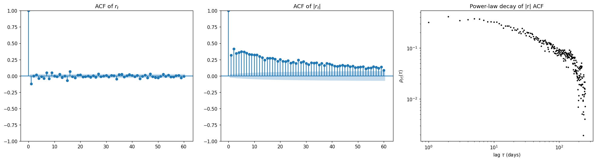

# 模块 3 · 随机过程 —— 从 GBM 到更复杂的市场动力学

> "Volatility, not return, is the variable that explains most of what happens in financial markets."
> —— Engle & Patton (2001), paraphrased

1971 年,数学家 Alan Hawkes 在 *Biometrika* 58(1) 发表了 *Spectra of Some Self-Exciting and Mutually Exciting Point Processes*——一篇当时几乎没人引用、四十年后突然成为一整个子领域基础设施的论文。 Hawkes 当时想解决的问题不在金融,而在**地震学**:余震序列里的事件强度依赖于过去的事件——一次大震发生后,接下来几小时到几天里,小震和余震的概率显著上升,然后慢慢衰减回背景速率。普通的 Poisson 过程没法描述这种"过去影响未来"的结构,因为 Poisson 假设事件间相互独立。Hawkes 给的解是把强度本身写成历史事件的函数——每发生一个事件,瞬时强度跳一下,然后按某个核 $\phi$ 衰减。地震学社区把这套模型用了二十多年——直到 2000 年代初,Bacry–Muzy 和 Bouchaud 几代人意识到限价单簿里的事件序列结构和余震序列在数学上是同一类对象。从那以后,Hawkes 过程在量化金融里几乎成了高频数据分析的默认建模工具。这一章的目的之一,是看清楚一个 1971 年从地震学里出来的工具,怎么变成了 2010 年代金融市场最重要的微观结构语言之一。

模块 2 告诉我们**收益率分布是重尾的**——但那是把整条时间序列拍扁成一个直方图看的结果。这模块要把时间维度加回来:**收益率序列怎么按时间演化?它的内部结构是什么?**

读完本模块后,你应该能:

1. 写出 GBM 的 SDE 并解释为什么它是衍生品定价的基线模型,也能说出它**做不对的至少三件事**
2. 区分跳跃过程(Merton jump-diffusion)和自激过程(Hawkes)——前者是时间独立的"飞来横祸",后者是事件成簇出现
3. 解释"波动率聚集"这一 stylized fact,并写出 GARCH(1,1) 的递推式
4. 用 Python 验证 S&P 500 的 $r_t$ 自相关短(几小时就消)而 $|r_t|$ 自相关长(几十天还在)

---

## 3.1 基线模型:几何布朗运动(GBM)

Bachelier 1900 的算术布朗运动 $dS_t = \mu\,dt + \sigma\,dW_t$ 有个尴尬:价格能跌穿 0。Samuelson 1965 把它改成**几何布朗运动(Geometric Brownian Motion, GBM)**:

$$
\frac{dS_t}{S_t} = \mu\,dt + \sigma\,dW_t \quad\Longleftrightarrow\quad d(\ln S_t) = \left(\mu - \tfrac12 \sigma^2\right) dt + \sigma\,dW_t
$$

其中 $W_t$ 是标准布朗运动。这意味着 $\ln S_t$ 服从布朗运动,价格本身是 lognormal,**收益率严格正态**。

GBM 是 Black–Scholes–Merton(1973)期权定价公式的引擎。它的成功主要源于**数学闭包**:lognormal × Itô calculus = 解析解。

但 GBM 在数据上至少做错三件事:

| 错处 | 经验事实 |
|---|---|
| 收益率正态 | 重尾(模块 2) |
| 波动率 $\sigma$ 是常数 | 波动率聚集、随时间变化 |
| 价格路径连续 | 财报、宏观新闻、订单簿失衡都能造成"瞬间跳" |

后面三节分别拆这三条。

这三条里第三条"价格路径连续"在 1987 年 10 月 19 日被一次性证伪。S&P 500 在那个交易日里下跌 22.6%,但比"日内总跌幅"更让人不舒服的是日内的几个时刻——市场某些时段几乎没有报价,价格不是"快速下跌",是直接**跳**到下一个数字。Black–Scholes 框架下的 GBM 假设价格路径是几乎处处连续的(其实是处处不可微但连续);Black Monday 让所有人在同一天看到了这件事不真。但金融工业的反应不是放弃 GBM。它的反应是**在 GBM 上打补丁**:1990 年代起,大家用**隐含波动率 smile**(为每个执行价格反推不同的 $\sigma$,本质上承认尾巴更厚但不改基线)、用 jump-diffusion(下一节的 Merton 模型,加一个 Poisson 跳跃项),最后用 SABR、Heston、rough Bergomi 这一族越来越复杂的随机波动率模型。每一代都更精巧,每一代都保留了"价格路径基本连续 + 收益率基本 Gaussian"的核心假设——异常被吸收进辅助构造,而不是改写基线。这条历史本身就是 econophysics 想要点出的事:**当数据告诉你模型错的时候,有两种处理方式,行业选了哪一种是个文化问题,不是技术问题**。

---

## 3.2 跳跃过程:Merton jump-diffusion

Merton(1976)在 GBM 上加一个 **Poisson 跳跃项**:

$$
\frac{dS_t}{S_{t^-}} = \mu\,dt + \sigma\,dW_t + (J_t - 1)\,dN_t
$$

其中 $N_t$ 是强度 $\lambda$ 的 Poisson 计数过程,$\ln J_t \sim \mathcal{N}(\mu_J, \sigma_J^2)$ 是每次跳跃的对数比例。

**直觉**:大部分时间价格沿 GBM 走,但每隔(平均)$1/\lambda$ 时间就被踢一脚。

**得到了什么**:重尾、瞬间不连续路径、可以解释隐含波动率的"smile"。

**没解决**:**跳跃在时间上独立**——但真实数据里崩盘往往**成簇出现**(2008 年 9 月那两周连着几个 -5%)。

---

## 3.3 自激过程:Hawkes

Hawkes(1971)提出**自激点过程**:事件发生强度依赖于历史事件,**过去的跳跃增加未来跳跃的概率**。

$$
\lambda(t) = \lambda_0 + \sum_{t_i < t} \phi(t - t_i)
$$

其中 $\phi(\cdot)$ 是衰减核(典型选择 $\phi(s) = \alpha e^{-\beta s}$,$\alpha < \beta$ 保证次临界)。每发生一个事件,瞬时强度跳一下,然后指数衰减回基础水平。

**直觉**:一个跳跃发生后,系统"紧张"一段时间,容易再跳一次。这正是危机期"余震"的数学形式。

**为什么物理学家爱 Hawkes**:它有一个**临界点 $\eta = \int_0^\infty \phi(s)\,ds = \alpha/\beta = 1$**。$\eta < 1$ 是次临界(每个事件产生不到 1 个后代),$\eta = 1$ 是临界(系统恰好自维持),$\eta > 1$ 爆炸。市场实证估计**$\eta$ 通常在 0.7–0.95**——非常接近临界——这是模块 5 临界现象的伏笔。

**应用**:订单到达率(Bacry–Muzy 一脉)、新闻冲击衰减、限价单簿事件序列。

"$\eta$ 一直在 0.9 附近"这件事,在统计物理里是有名字的——**自组织临界(Self-Organized Criticality, SOC)**,Bak、Tang、Wiesenfeld 1987 年那篇 *PRL* 59, 381。Bak 的主张是:某些系统不需要外部精细调参,就能自己被驱动到临界状态附近,沙堆模型是标本——你不断往堆顶加沙,雪崩规模分布会自动收敛到一个幂律。如果市场的 Hawkes $\eta$ 长期稳定在临界点下方一点,那"谁在调参"这件事就值得问。我个人偏爱的假说是:流动性提供者(做市商、套利者、HFT)构成一个**反馈回路**,它一面把过强的扰动吸收掉避免 $\eta$ 超过 1,一面又不会把所有扰动都熨平——剩下来的就是 $\eta \approx 0.9$ 这种"准临界"。这条对应关系很干净,但目前还没有严格的推导。模块 5 §5.5 会再回到这件事。

我想在这里点出 Hawkes 在金融里第一次被严肃用起来的具体场景:**2010 年 5 月 6 日 Flash Crash**。下午 14:42 到 14:47 之间,Dow 在大约五分钟里跌了约 9%,然后二十分钟内基本恢复。SEC 与 CFTC 2010 年 9 月 30 日联合报告 *Findings Regarding the Market Events of May 6, 2010* 给出了完整的事件重建:一笔约 41 亿美元的 E-mini S&P 500 期货卖单,被一个用 VWAP 算法的对冲基金分散执行;算法只看成交量、不看时间也不看价格;它的下单速率与对手方 HFT 的库存能力之间发生了正反馈;流动性提供者集体撤出,价格在没有买盘的真空里自由下落。从微观结构的语言看,**这是 Hawkes 自激在五分钟尺度上的失控版本——每一笔卖单成倍提升下一笔卖单的强度,直到 $\eta$ 实际上跨过了 1**。Bacry、Mastromatteo 和 Muzy 后续用 Hawkes 拟合 Flash Crash 期间的订单流强度,得到的就是这种"$\eta$ 暂时性穿过 1"的图像。

---

## 3.4 长程相关与波动率聚集

GBM 假设波动率 $\sigma$ 是常数。但你打开任何一段股价数据都能眼看出来:**大波动跟着大波动,小波动跟着小波动**——这就是 **波动率聚集(volatility clustering)**。

形式化:收益率本身的自相关 $\rho_r(\tau) = \mathrm{Corr}(r_t, r_{t+\tau})$ 在 $\tau > $ 几分钟后**接近 0**(否则可套利)。但 $|r_t|$ 或 $r_t^2$ 的自相关 $\rho_{|r|}(\tau)$ **以幂律衰减**:

$$
\rho_{|r|}(\tau) \sim \tau^{-\gamma}, \quad \gamma \in (0.2, 0.4)
$$

这意味着 $|r_t|$ 有**长程依赖**(long-range dependence, LRD):自相关函数不可积,$\sum_\tau \rho_{|r|}(\tau) = \infty$。

### 3.4.1 ARCH / GARCH 家族

Engle(1982, 诺奖 2003)的 **ARCH** 和 Bollerslev(1986)的 **GARCH** 把这件事建成递推模型。GARCH(1,1):

$$
r_t = \sigma_t \varepsilon_t, \quad \varepsilon_t \sim \text{iid}\, \mathcal{N}(0,1)
$$
$$
\sigma_t^2 = \omega + \alpha r_{t-1}^2 + \beta \sigma_{t-1}^2
$$

**直觉**:今天的波动率方差由(常数)+ (昨天的收益率平方,衡量"刚被打了一下")+ (昨天的波动率,衡量"持续紧张")决定。

经验估计:股票数据上 $\alpha + \beta \approx 0.99$,**非常接近 1**(IGARCH 边界)——又一次接近临界。

**GARCH 的限制**:它给出的自相关是**指数衰减**,$\rho_{|r|}(\tau) \sim (\alpha+\beta)^\tau$。当 $\alpha+\beta$ 极接近 1 时这看起来像幂律,但严格地不是。要严格建幂律自相关,需要 **FIGARCH**(分数阶 integrated GARCH)、**长记忆波动率模型**或更直接的 **multifractal** 模型(Mandelbrot–Calvet–Fisher)。

### 3.4.2 随机波动率(SV)模型

另一脉是把波动率自己写成一个 SDE。Heston(1993)是衍生品定价的工业标准:

$$
dS_t = \mu S_t\,dt + \sqrt{V_t}\,S_t\,dW_t^S
$$
$$
dV_t = \kappa(\theta - V_t)\,dt + \xi \sqrt{V_t}\,dW_t^V
$$

两个布朗运动的相关 $\rho = \mathrm{Corr}(dW^S, dW^V)$ 通常为负(**杠杆效应**:股票下跌时波动率上升)。

近几年的明星是 **rough volatility**(Gatheral–Jaisson–Rosenbaum 2018):波动率的对数被建成 Hurst 指数 $H \approx 0.1$ 的分数布朗运动(**比标准 BM 更"粗糙"**)。它一次性解释了波动率聚集 + 隐含波动率曲面的形状,是 2010 年代最重要的发现之一。

值得在这里先标记一件后面要回来的事:rough volatility 是**经验事实——$H \approx 0.1$ 在 SPX、欧股、日元等多个市场跨多个时间尺度都成立——但底层机制至今没有统一的微观推导**。三类候选都还活着:(a)订单簿上的 Hawkes 自激核如果选成长程衰减(power-law instead of exponential),coarse-grain 之后可以给出 rough 波动率;(b)元订单的拆单结构本身会在汇总波动率上产生 anti-persistent 的相关,$H < 1/2$ 是其指纹;(c)信息异质性下,信念更新过程的反馈本身就生成 fractional 噪声。这三条没有一条目前算"证毕",且它们不是互斥的——可能三个机制各占一些。模块 8 §8.4.1 会回到这条开放问题。

---

## 3.5 实战:Python Lab —— 自相关结构对比

下面这段代码用 S&P 500 验证:**$r_t$ 自相关短,$|r_t|$ 自相关长**。

```python
import numpy as np
import yfinance as yf
import matplotlib.pyplot as plt
from statsmodels.graphics.tsaplots import plot_acf

spx = yf.download("^GSPC", start="2005-01-01", end="2025-01-01", auto_adjust=True)
r = np.log(spx["Close"]).diff().dropna().values.flatten()

fig, axes = plt.subplots(1, 3, figsize=(18, 5))

# 1. 收益率本身的自相关:几乎为零
plot_acf(r, lags=60, ax=axes[0], title=r"ACF of $r_t$")

# 2. 绝对值的自相关:长长的尾巴
plot_acf(np.abs(r), lags=60, ax=axes[1], title=r"ACF of $|r_t|$")

# 3. log-log:看是否幂律衰减
from statsmodels.tsa.stattools import acf
lags = np.arange(1, 250)
acf_abs = acf(np.abs(r), nlags=lags.max(), fft=True)[1:]
mask = acf_abs > 0
axes[2].loglog(lags[mask], acf_abs[mask], "k.", ms=4)
axes[2].set_xlabel(r"lag $\tau$ (days)")
axes[2].set_ylabel(r"$\rho_{|r|}(\tau)$")
axes[2].set_title("Power-law decay of |r| ACF")

# 拟合斜率
slope, intercept = np.polyfit(np.log(lags[mask][:100]), np.log(acf_abs[mask][:100]), 1)
print(f"Estimated decay exponent gamma = {-slope:.2f}")

plt.tight_layout()
plt.show()
```

跑出来的数字(`scripts/m03.py`):

```text
Estimated decay exponent gamma = 0.45
ACF(r) at lag 1, 2, 3 = -0.121, 0.002, 0.016
ACF(|r|) at lag 1, 10, 60 = 0.320, 0.322, 0.088
```



三张图配这几行打印,落地结论是:

1. **左:$r_t$ 的 ACF**——lag 1 出现 -0.12 这种小幅负相关(短期反转的痕迹),之后基本钻进置信带。**方向不可预测**
2. **中:$|r_t|$ 的 ACF**——lag 1 就是 0.32,到 lag 10 仍是 0.32,到 lag 60 还有 0.09,**完全不像独立同分布**——这就是波动率聚集
3. **右:log-log 衰减**——斜率给出 $\gamma \approx 0.45$,落在文献的 $0.2 \sim 0.5$ 区间内,确认幂律而非指数衰减

---

## 3.6 常见误解

- **"GBM 是错的,所以期权定价是错的"**——GBM 是简化,Black–Scholes 仍是行业基线。改进基线时(SV、jump-diffusion)往往在校准复杂度和拟合度之间挣扎,实务里 BS + 隐含波动率曲面是主流。
- **"GARCH 解释了重尾"**——部分。GARCH(1,1) + 高斯 innovation 能产出重尾(混合效应),但尾巴仍偏轻;通常需要 Student-t innovation。
- **"长程相关 = 长期可预测"**——错。$|r_t|$ 的长程相关说的是**波动率可预测**,不是**方向可预测**。后者依然短程独立。
- **"jump-diffusion 已经够用了"**——它解决了跳跃和重尾,但**没有抓住事件成簇**这个事实。Hawkes 是把这个补上的最自然工具。
- **"rough volatility 是数学游戏"**——经验上 $H \approx 0.1$ 是 robust 跨多个市场、多个时间尺度的现象,且能一次性解释隐含波动率 ATM skew 的近期行为。

---

## 3.7 章末小结与延伸

### 本模块核心回顾

1. **GBM 是基线但错三处**:正态收益率、常数波动率、连续路径。
2. **跳跃 vs 自激**:Merton jump-diffusion 处理"飞来横祸",Hawkes 处理"事件成簇"。市场实证里 Hawkes 的临界参数 $\eta \approx 0.8$–0.95 暗示**市场长期处于近临界状态**。
3. **波动率聚集是 stylized fact 第二条**:$|r_t|$ 自相关幂律衰减,指数 $\gamma \approx 0.3$。
4. **GARCH 是工业基线**,$\alpha + \beta$ 极接近 1。要严格建幂律 ACF 需要 FIGARCH、multifractal 或 rough volatility。
5. **rough volatility($H \approx 0.1$)** 是 2010 年代最重要的实证发现,把波动率本身写成"比 BM 更粗糙"的过程。

### 习题

#### 习题 3.1(简单)

GBM 写成 SDE 是 $dS_t = \mu S_t\,dt + \sigma S_t\,dW_t$。用 Itô 引理推出 $\ln S_t$ 的 SDE,解释为什么漂移项里出现 $-\sigma^2/2$。

#### 习题 3.2(中等)

Hawkes 过程的临界参数定义为 $\eta = \int_0^\infty \phi(s)\,ds$。说明为什么 $\eta=1$ 是临界点(每个事件平均产生 1 个后代)。市场估计 $\eta \approx 0.9$ 意味着什么?

#### 习题 3.3(中等,需跑代码)

跑 3.5 节代码。然后:
(a) 比较 $r_t^2$ 和 $|r_t|$ 的 ACF。理论上哪个衰减更快?数据上呢?
(b) 把窗口缩成 2008–2009,$|r_t|$ 的 ACF 平台高度变化吗?为什么?

#### 习题 3.4(中等)

写出 GARCH(1,1) 的稳态方差 $E[\sigma_t^2]$,要求 $\alpha + \beta < 1$。当 $\alpha + \beta \to 1$ 时它的行为如何?

#### 习题 3.5(开放)

Hawkes 自激 $\eta \approx 0.9$、GARCH $\alpha+\beta \approx 0.99$、IGARCH 边界、rough vol $H \approx 0.1$——它们都**指向同一个方向:市场长期处于近临界状态**。这是巧合还是有更深的统一?(模块 5 会给一个候选答案。)

### 延伸阅读

**必读:**

- Cont, R. (2001). "Empirical properties of asset returns." *Quantitative Finance*, 1, 223–236. —— Stylized facts 标准清单。
- Engle, R. F. (2002). "New frontiers for ARCH models." *Journal of Applied Econometrics*, 17, 425–446. —— ARCH 家族综述。

**值得翻:**

- Bacry, E., Mastromatteo, I., & Muzy, J.-F. (2015). "Hawkes processes in finance." *Market Microstructure and Liquidity*, 1(1). —— Hawkes 在金融的全景综述。
- Gatheral, J., Jaisson, T., & Rosenbaum, M. (2018). "Volatility is rough." *Quantitative Finance*, 18(6), 933–949.

**进阶:**

- Cont, R., & Tankov, P. (2003). *Financial Modelling with Jump Processes*. —— 跳跃过程的工业级参考书。
- Bouchaud, J.-P., & Potters, M. (2003). *Theory of Financial Risk and Derivative Pricing*. —— 第 7–9 章。

---

### 下一模块预告

模块 4 进入**多资产**世界。重尾刻画了单资产分布,波动率聚集刻画了单资产时间结构,接下来要刻画**资产之间的关联**——而这件事在高维下出乎意料地难。RMT(随机矩阵论)告诉我们:**$N$ 只股票、$T$ 天数据,当 $q = N/T$ 不可忽略时,样本协方差矩阵的大部分特征值其实是噪声**。

---

> **本模块一句话总结**
>
> 把 GBM 撕开三个洞(重尾、波动率聚集、跳跃),每个洞对应一族扩展模型——而几乎所有扩展(Hawkes、GARCH、rough vol)都不约而同地指向"近临界"。

---

## 📝 学习记录

| 项 | 内容 |
|---|---|
| 起始日期 | |
| 完成日期 | |
| 卡点(看不懂的概念 / 跑不通的代码 / 想不清楚的论证) | |
| 关键收获 | |
| 配套代码仓库链接 | |
