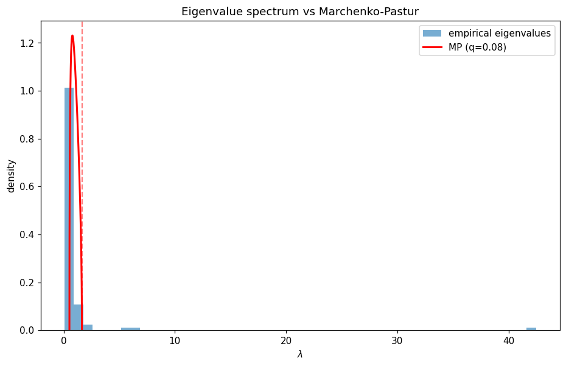

# 模块 4 · 关联结构与随机矩阵论 —— 多资产世界里的信号和噪声

> "Most of the eigenvalues of the empirical correlation matrix are pure noise."
> —— Laloux, Cizeau, Bouchaud & Potters, *Phys. Rev. Lett.* 83, 1467 (1999)

1999 年，巴黎的一间办公室——大概是 Service de Physique de l'État Condensé 当时的那栋楼。Laurent Laloux、Pierre Cizeau、Jean-Philippe Bouchaud、Marc Potters 把 1991 到 1996 年 S&P 500 成分股的日收益率数据装进同一个矩阵，做样本相关阵，算特征值。他们对这件事的预期是有的——核物理学家从 1950 年代起就知道大随机矩阵的特征值分布有 universal 的形态（Wigner、Dyson），而 Marchenko 和 Pastur 在 1967 年给出了样本协方差的对应版本。但他们没预期的是，**真实股票数据的特征值谱**——除了几个明显的 outlier 之外——和 Marchenko–Pastur 噪声分布几乎重合。他们把这件事的含义说得很直接：这意味着 S&P 500 样本相关阵里**绝大部分特征值是噪声**，没有结构。这篇 *Physical Review Letters* 83， 1467 是 econophysics 把核物理工具搬过来解决金融问题最干净的一次——一个 1967 年从随机矩阵理论里来的结果，完全没有为金融做任何修改，直接落到组合经理每天都在用但从未真正理解的样本协方差矩阵上。

模块 2、3 看的是单只资产。这模块进入**多资产**世界。一个组合经理面对 $N = 500$ 只股票，需要协方差矩阵 $\Sigma$ 做风险测算和组合优化。她从历史数据估出一个样本协方差矩阵 $\hat\Sigma$——**这个 $\hat\Sigma$ 里有多少是信号、多少是噪声？**

读完本模块后，你应该能：

1. 解释为什么在 $N/T$ 不小时样本协方差矩阵"退化"——具体退化到什么样子
2. 写出 Marchenko-Pastur 分布的支撑区间公式，知道它意味着什么
3. 用 Python 把 S&P 500 成分股的样本相关矩阵特征值谱画出来，**眼看到** MP 噪声谱 + 几个"漏网"的真实信号
4. 描述 eigenvalue clipping 去噪的基本流程，并说出其在组合优化里的实际影响

---

## 4.1 协方差矩阵在高维下的退化

记 $N$ 只资产、$T$ 个时间观测，收益率矩阵 $R \in \mathbb R^{T \times N}$。样本协方差是：

$$
\hat\Sigma = \frac{1}{T} R^\top R \quad (\text{已中心化})
$$

经典统计假设 $T \to \infty$、$N$ 固定：$\hat\Sigma \to \Sigma$，所有特征值都收敛到真值。

**高维**视角（Marchenko–Pastur 1967、Bai–Silverstein 等）处理的是 $N, T \to \infty$ 且 $q = N/T \to \text{const}$ 的情形，**根本不收敛**：即使真值 $\Sigma = I_N$（完全不相关），样本协方差 $\hat\Sigma$ 的特征值谱仍铺开成一个**有宽度的分布**。

实务里这意味着：

- 标普 500，日数据 5 年 ≈ 1250 天，$q = 500/1250 = 0.4$ —— 非常不可忽略
- 组合优化用 Markowitz 公式 $w^* = \Sigma^{-1}\mu$ 要求矩阵求逆，**$\hat\Sigma$ 的小特征值被放大成巨大权重**——这就是"Markowitz 优化输出垃圾"现象的数学根源

值得提一下 Harry Markowitz 本人后来对自己 1952 年那篇 *Journal of Finance* 的态度。Markowitz 在多次公开访谈里——Jason Zweig 在《Your Money and Your Brain》及多篇专栏里反复引用过——承认自己个人退休金账户基本是**等权重持有**几只指数基金，不做均值-方差优化。他给的理由不是"我的理论错了"，而是大致"在我自己面对的样本规模和噪声水平下，这个最优化解不出有意义的东西"。这件事的物理学翻译是：**Markowitz 公式假设 $\Sigma$ 是给定的，但在 $N/T = 0.4$ 这种现实情形下，$\hat\Sigma$ 不是 $\Sigma$**——它的小特征值是噪声乘以小数除得很大的杠杆，推出的权重几乎都在某几个方向上极端配置。Bouchaud–Potters 那本书第 10 章把这件事用数据画出来，结论简单：**用噪声 $\hat\Sigma$ 直接做 Markowitz，样本外组合的实现波动率比直接等权重还高**。Markowitz 这话不是谦虚，是统计精度的真实约束。

---

## 4.2 Marchenko-Pastur 分布：噪声基线

**定理**（Marchenko–Pastur 1967）：设 $R$ 的元素是 iid 标准化噪声，$N, T \to \infty$，$q = N/T \in (0, 1]$。则 $\hat\Sigma = T^{-1} R^\top R$ 的经验特征值分布以概率 1 收敛到 **MP 分布**：

$$
\rho_{MP}(\lambda) = \frac{1}{2\pi q \lambda} \sqrt{(\lambda_+ - \lambda)(\lambda - \lambda_-)}, \quad \lambda \in [\lambda_-, \lambda_+]
$$

其中支撑区间端点：

$$
\lambda_\pm = (1 \pm \sqrt{q})^2
$$

**直觉**：

- $q = 0$（$T \gg N$）：$\lambda_\pm \to 1$，所有特征值压在 1 附近——经典统计
- $q = 1$($T = N$):$\lambda_- = 0$,$\lambda_+ = 4$——一半的"信息"被噪声吞掉
- $q > 1$（$T < N$）：$\hat\Sigma$ 奇异，有 $N - T$ 个零特征值

这个分布是**完全没有真实相关性时的样本特征值谱**——任何在 $[\lambda_-, \lambda_+]$ 内的特征值都和 iid 噪声不可区分。

Marchenko–Pastur 1967 的工作不是凭空冒出来的。它是核物理学几十年传统的延续。Eugene Wigner 1955 年在研究复杂原子核能级时，提出"如果哈密顿量太复杂以至于精细结构不可能算出来，把它的矩阵元当作随机数，看会得到什么"——结果发现重核的能级间距分布满足一个 universal 的形式（后来叫 Wigner surmise）。Freeman Dyson 1962 年的三篇 *Journal of Mathematical Physics* 论文把随机矩阵分到三个 universality class（GOE/GUE/GSE），从对称性出发推出每一类的谱统计。Marchenko 和 Pastur 是把这套思路推到样本协方差矩阵的对应版本——同样的 universality 论证，不依赖具体的数据生成机制，只依赖维度比 $q = N/T$。这件事在 1990 年代之前几乎只有数学物理社区在意，直到 Laloux 等人发现 S&P 500 的样本相关阵谱**真的**和 MP 几乎重合——这才把"core physics 的 universality 也适用于金融"这件事从猜想变成事实。**为什么 universality 能跨越如此不同的物理对象？** 它不依赖核内强相互作用的细节，也不依赖股票的具体经济结构——它是关于"大随机矩阵的本征值在什么尺度上分布"的一个定理，前提只要求矩阵元有有限的二阶矩和某种独立性。这是 econophysics 借用物理工具最干净的一次：不是类比，是直接同一个定理在另一个领域的应用。

---

## 4.3 实证：S&P 500 的特征值谱

Laloux 等人 1999 年那篇 PRL 把 S&P 500 收益率的相关矩阵谱画出来，得到了一个 econophysics 的标志性图像：

- 大部分特征值落在 $[\lambda_-, \lambda_+]$ 内，**和 MP 分布几乎重合**——纯噪声
- 一个**远远大于 $\lambda_+$ 的最大特征值**——对应"市场模式"（market mode）：所有股票同涨同跌的成分，典型占总方差的 20%–40%
- 几个超出 $\lambda_+$ 的"中等"大特征值——对应**行业模式**（银行、能源、科技板块的成簇）
- 谱底有时也有"漏网"的小特征值——对应严格的对冲对（pair trading 关系）

**结论**：在 $N=500$、$T \sim 1000$ 的样本里，$\hat\Sigma$ 的**大约 90% 的特征值是噪声**。

### 4.3.1 跨地区扩展：MP 在加密、商品、债券都适用

同样的方法应用到不同资产类：
- 加密货币：市场模式权重更大（2017–2022），反映高度同质性
- 商品：特征值谱有更多"散点"超出 MP，反映多个独立宏观因子
- 债券：近似低维，期限结构决定大部分方差

### 4.3.2 2008：谱结构的相变

2008 年危机给了这套框架一个干净的压力测试。常态下 S&P 500 的特征值谱里，行业模式（科技、金融、能源…）对应 4–6 个清晰的中等大小特征值，跳出 MP 上界但远小于市场模式。Lehman 倒闭（2008-09-15）、AIG 救助（2008-09-16）之后的两个月里，这些行业模式的特征值显著**塌缩进市场模式**——也就是说，所有行业一起跌、几乎没有分化，样本相关阵的有效低维结构从"市场 + 多个行业 factor" 变成 "只有一个 factor"。这件事在多个文献里报告过（Bouchaud–Potters 第 10 章、Münnix 等 2012 *Scientific Reports* 2：644）。物理学家的语言里这叫**谱集中**或者**因子坍缩**——危机期间，系统的有效自由度数量急剧下降，所有方向变成同一个方向。模块 5 §5.4 里"关联网络致密化"作为 early warning signal，本质上是同一件事的另一种测量方式。

---

## 4.4 Eigenvalue Clipping：噪声清洗

最简单的 RMT 去噪流程（Laloux 1999）：

1. 谱分解 $\hat\Sigma = \sum_i \lambda_i v_i v_i^\top$
2. 把所有 $\lambda_i \in [\lambda_-, \lambda_+]$ 替换成一个**常数**（通常是这段内特征值的均值，以保持迹不变）
3. 保留 $\lambda_i > \lambda_+$ 的特征值原样
4. 重组 $\Sigma^{\text{clip}}$

直觉：谱内的特征向量是"噪声方向"，我们不相信它们有结构，所以拍成各向同性；谱外的是信号，留下。

**实务效果**：在样本外组合优化里，$\Sigma^{\text{clip}}$ 给出的最小方差组合的实现波动率显著低于直接用 $\hat\Sigma$。Bouchaud–Potters 的书里有数据。

### 4.4.1 进一步：RIE(Rotational Invariant Estimator)

Ledoit–Péché、Bun–Bouchaud–Potters 等推出了比 clipping 更优雅的 **RIE**：不是粗暴地拍平噪声特征值，而是用 **Stieltjes 变换**给出每个 $\lambda_i$ 的"最优收缩量"。在 RMT 框架下可以证明 RIE 是 Frobenius 范数意义下的 oracle 估计的最优旋转不变版本。

工业上 RIE 已经基本取代 clipping。但 clipping 是教学起点，而且**实务效果与 RIE 接近**。

值得说清楚 RMT 去噪在严肃量化机构里的具体形态——它**不是**一次性研究项目，而是**每天跑一次的生产流水线**。在 CFM 这样的机构，清晨数据更新之后，样本相关阵在过去 $T$ 天的滚动窗口上算一次，RIE 套上去，得到清洗后的 $\hat\Sigma_t^{\text{clean}}$，这个对象直接进风控限额、组合优化、敞口测算的输入端。$T$ 的选择本身是个工程问题：太短信号弱，太长资产间的真实关系在窗口内已经变了。这件事在公开文献里写得最清楚的是 Bun–Bouchaud–Potters 2017 那篇 *Physics Reports*——而 Bouchaud 本人又是 CFM 的董事长，这是少数公开发表学术研究并把同样方法用在生产里的机构，这种"学界 + 业界"的双轨在 econophysics 里是 Bouchaud 一脉的招牌。从 1999 年那篇 *PRL* 到 2017 年的 *Physics Reports*，这条线大概是 econophysics 把一个学术结果工业化得最完整的范例。

---

## 4.5 实战：Python Lab —— 画出 S&P 500 的特征值谱

```python
import numpy as np
import pandas as pd
import yfinance as yf
import matplotlib.pyplot as plt

# 取标普 100 的成分(为了速度;原版是 500)
tickers = [
    "AAPL","MSFT","GOOGL","AMZN","META","TSLA","NVDA","JPM","JNJ","V",
    "PG","UNH","HD","MA","BAC","DIS","XOM","ABBV","KO","PEP",
    "MRK","CVX","WMT","PFE","CSCO","LLY","TMO","ABT","COST","AVGO",
    "MCD","ACN","DHR","NEE","NKE","WFC","TXN","CRM","ORCL","ADBE",
    "BMY","UNP","UPS","HON","RTX","QCOM","T","LOW","LIN","SBUX",
    "IBM","INTC","AMGN","GS","CAT","BLK","BA","MDT","C","AXP",
    "PM","SCHW","DE","ISRG","SPGI","MS","MMM","NOW","INTU","BKNG",
    "GE","CVS","TGT","ADP","PLD","AMT","MO","ZTS","TJX","CB",
    "DUK","CL","SO","SYK","BDX","LMT","CCI","MMC","ITW","COP",
    "MDLZ","AMD","ADI","GILD","REGN","ETN","BSX","EOG","FIS","CME",
]

px = yf.download(tickers, start="2020-01-01", end="2025-01-01", auto_adjust=True)["Close"]
px = px.dropna(axis=1, thresh=int(0.95 * len(px)))   # 丢弃缺数据严重的
ret = np.log(px).diff().dropna()
N, T = ret.shape[1], ret.shape[0]
q = N / T
print(f"N={N}, T={T}, q={q:.3f}")

# 标准化后求样本相关矩阵
Z = (ret - ret.mean()) / ret.std()
C = (Z.T @ Z).values / T
eigvals = np.linalg.eigvalsh(C)

# MP 理论谱
lam_minus = (1 - np.sqrt(q))**2
lam_plus  = (1 + np.sqrt(q))**2
lam_grid = np.linspace(lam_minus, lam_plus, 500)
mp_pdf = np.sqrt((lam_plus - lam_grid) * (lam_grid - lam_minus)) / (2 * np.pi * q * lam_grid)

fig, ax = plt.subplots(figsize=(10, 6))
ax.hist(eigvals, bins=50, density=True, alpha=0.6, label="empirical eigenvalues")
ax.plot(lam_grid, mp_pdf, "r-", lw=2, label=f"MP (q={q:.2f})")
ax.axvline(lam_plus, color="r", ls="--", alpha=0.5)
ax.set_xlabel(r"$\lambda$"); ax.set_ylabel("density")
ax.set_title("Eigenvalue spectrum vs Marchenko-Pastur")
ax.legend()

# 标注超出 MP 上界的特征值
outliers = eigvals[eigvals > lam_plus]
print(f"#eigenvalues > lambda_+ = {len(outliers)} / {N}")
print(f"largest = {eigvals[-1]:.2f}  (market mode)")

plt.show()
```

跑出来的数字（`scripts/m04.py`，2020–2024 五年日数据）：

```text
N=99, T=1257, q=0.079
#eigenvalues > lambda_+ = 5 / 99
lambda_+ (MP upper edge) = 1.640
largest = 42.46  (market mode)
top 5 eigenvalues: [42.46, 6.33, 5.61, 2.10, 1.82]
```



照着图和数字读：

- 大部分特征值挤在 $[\lambda_-, \lambda_+] \approx [0.51, 1.64]$ 这段内，与红色 MP 曲线重合——**99 个里有 94 个被理论吸收成"噪声方向"**
- $\lambda_+$ 附近确有断崖，边缘衔接干净
- 右侧 **5 个孤立大特征值** 跳出 MP 区域：最大 42.46 ≈ 26 倍 $\lambda_+$，这就是**市场模式**（几乎所有股票一起涨/跌）
- 6.33、5.61、2.10、1.82 这四个超出但不夸张——对应**行业模式**（科技、能源、金融…）
- 用 clipping 时，会把 [0.51， 1.64] 之间的特征值替换成它们的均值，只保留这 5 个 outlier 的信息

---

## 4.6 常见误解

- **"用更多数据就好了"**——延长 $T$ 可以降低 $q$，但金融数据非平稳，过长窗口里 $\Sigma$ 本身在变，得失抵消。实务上最优窗口往往是 1–2 年。
- **"clipping 把信息扔了"**——它扔的是**噪声方向**。如果你不扔，样本外预测更差。
- **"市场模式可以套利"**——所有股票同涨同跌的成分是宏观风险，不可分散，只能承担或对冲掉。
- **"高维统计 = 复杂"**——MP 公式本身只有一行，核心 insight 是 $q = N/T$ 而不是 $N$ 和 $T$ 各自。
- **"相关矩阵不变 = 协方差矩阵不变"**——相关结构（eigenvectors）和波动率水平（eigenvalues 的总尺度）是两件不同的事，实务里波动率变得更快。

---

## 4.7 章末小结与延伸

### 本模块核心回顾

1. **高维下样本协方差不收敛**——$q = N/T$ 不可忽略时，即使真值是 $I$，样本谱也铺开。
2. **MP 分布给出纯噪声基线**：$\lambda_\pm = (1 \pm \sqrt q)^2$，支撑区间外才是信号。
3. **S&P 500 的实证图像**：1 个市场模式 + 几个行业模式 + 大部分噪声。Laloux 1999 的标志结果。
4. **Eigenvalue clipping 是简单去噪**，RIE 是工业级版本；两者都把 Markowitz 优化从"输出垃圾"救回到"可用"。
5. **核心 take-away**：在高维世界里，**$\hat\Sigma$ 不是 $\Sigma$**——你看到的相关结构大部分是手指的影子，不是手。

### 习题

#### 习题 4.1（简单）

$N = 100$、$T = 250$，MP 谱的上下端点是多少？哪些特征值才算"信号"？

#### 习题 4.2（中等）

为什么 Markowitz 组合 $w^* \propto \hat\Sigma^{-1}\mu$ 对 $\hat\Sigma$ 的小特征值特别敏感？用谱分解写出来。

#### 习题 4.3（中等，需跑代码）

跑 4.5 节代码。然后：
（a） 把窗口缩成 1 年（$T \approx 250$），$q$ 会变到多少？MP 谱怎么变化？
（b） 计算最大特征值对应的特征向量的分量分布。它"长得像"什么——大致每个分量都是 $1/\sqrt N$？

#### 习题 4.4（开放）

如果你是基金风控，知道 $\hat\Sigma$ 的 90% 谱是噪声，但合规要求每天上交一个 VaR 数字。你会用 （a） 原始 $\hat\Sigma$、（b） clipping 去噪、（c） RIE 中的哪个，为什么？

### 延伸阅读

**必读：**

- Laloux, L., Cizeau, P., Bouchaud, J.-P., & Potters, M. (1999). "Noise dressing of financial correlation matrices." *PRL*, 83, 1467. —— 经典开篇。
- Bouchaud, J.-P., & Potters, M. (2003). *Theory of Financial Risk and Derivative Pricing*. Chapter 2 & 10.

**值得翻：**

- Plerou, V., et al. (2002). "Random matrix approach to cross correlations in financial data." *PRE*, 65. —— 完整谱分析。
- Bun, J., Bouchaud, J.-P., & Potters, M. (2017). "Cleaning large correlation matrices: tools from random matrix theory." *Physics Reports*, 666, 1–109. —— RIE 全景。

**进阶：**

- Bai, Z. & Silverstein, J. W. (2010). *Spectral Analysis of Large Dimensional Random Matrices*. —— 数学教材。
- Marchenko, V. A., & Pastur, L. A. (1967). 原始论文。

---

### 下一模块预告

模块 5 跳进**临界现象**。模块 3 我们注意到 Hawkes 自激和 GARCH 都"近临界"，模块 4 我们看到市场模式（共同因子）主导谱——这些都是相变前夜的特征。我们将把 Ising、序参量、log-periodic precursor 这些统计物理工具搬到崩盘预测和泡沫识别上，看看 Sornette 的争议方法到底走到哪里。

---

> **本模块一句话总结**
>
> 高维下"$\hat\Sigma$ 大部分是噪声"是 MP 定理给出的硬事实——一旦看过 S&P 500 的特征值谱叠在 MP 曲线上，你就再也不会天真地把样本协方差当真值用。

---

## 📝 学习记录

| 项 | 内容 |
|---|---|
| 起始日期 | |
| 完成日期 | |
| 卡点 | |
| 关键收获 | |
| 配套代码仓库链接 | |
