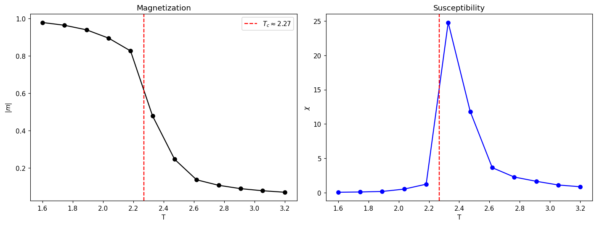

# 模块 5 · 临界现象 —— 相变、Ising 与崩盘预警

> "Crashes are not random — they are critical."
> —— Didier Sornette, *Why Stock Markets Crash* (2003)

1987 年 10 月 19 日,Didier Sornette 在 UCLA 的办公室,做的是异质性材料的断裂研究——一块复合材料在不断增加的应力下,微裂纹会先成核、再合并、最终在某个时刻以一次"灾难性"的方式崩坏。在这之前的几个月里,Sornette 的小组开发的工具是预测断裂时间 $t_c$ 的标度律:破裂前的微裂纹活动会按 $(t_c - t)^{-\alpha}$ 加速发散,这条曲线上面叠加一个 log-periodic 的小振荡。那天早晨 Dow 跌掉 22.6%,Sornette 立刻识别出了同一种模式——加速的波动、最终的灾难性事件、随后的余震结构。**市场和复合材料在这件事上是同一类对象**,这件事一旦在他脑里 click,接下来十年他写出来的就是 LPPL(Log-Periodic Power Law)模型,以及围绕它的整套崩盘前兆诊断方法。这一章的物理桥是 Ising 模型(凝聚态),但 Sornette 的入口是材料断裂——这件事本身说明"临界"在物理学里是一个跨子领域的共同语言。

模块 3 我们注意到 Hawkes 自激($\eta \approx 0.9$)、GARCH($\alpha+\beta \approx 0.99$)、rough vol($H \approx 0.1$)——都不约而同地"近临界"。模块 4 我们看到市场模式主导整个相关结构。这模块要把"临界"这个词从物理学严格地搬到金融:**当市场逼近崩盘时,它是否表现出统计物理意义上的相变前兆?**

读完本模块后,你应该能:

1. 写出 Ising 模型的 Hamiltonian,解释它和"羊群行为"的对应关系
2. 列出至少三个相变临界点的统计学标志(发散关联长度、幂律响应、log-periodic 振荡)
3. 解释 Sornette 的 LPPL(Log-Periodic Power Law)模型在做什么,以及它为什么有争议
4. 用 Python 跑一个简单的 Ising 模拟,亲眼看到磁化率在 $T_c$ 附近发散

---

## 5.1 Ising 模型回顾(物理学家速通版)

如果你学过统计力学,跳过本节。其他人:

二维 Ising 模型:格点上每个位置有自旋 $s_i \in \{-1, +1\}$,Hamiltonian:

$$
H = -J \sum_{\langle i,j \rangle} s_i s_j - h \sum_i s_i
$$

$J > 0$:邻居倾向同向(铁磁);$h$:外场。给定温度 $T$,平衡分布是 Boltzmann $P(\{s\}) \propto e^{-H/T}$。

**临界温度** $T_c$:低于 $T_c$,系统自发磁化(序参量 $m = \langle s \rangle \neq 0$);高于 $T_c$,无序($m = 0$)。在 $T = T_c$ 时几乎所有量都发散或不可解析:

- 关联长度 $\xi \sim |T - T_c|^{-\nu}$ 发散
- 磁化率 $\chi = \partial m / \partial h \sim |T - T_c|^{-\gamma}$ 发散
- 系统在所有尺度上自相似——分形结构(**重整化群**的入口)
- 涨落 $\langle (\Delta m)^2 \rangle$ 发散——市场对应"波动率爆炸"

物理学家的本能:**如果一个系统在临界点附近,它会表现出 universal 的标度律,不依赖微观细节**——这正是 econophysics 想搬过来的东西。

---

## 5.2 金融市场的"Ising 类比"

最直接的映射:股票=自旋,$s_i = \pm 1$ 表示"看涨/看跌",$J_{ij}$ 表示交易者之间的影响强度,$h$ 是新闻冲击。

这里 Ising 格点不是粒子格,而是**信念格**:$J_{ij}$ 是认知影响强度,温度 $T$ 衡量信念异质性。这不是借用过来的凝聚态物理,是 self-referential 物理(模块 8 §8.1)在临界这条线上的具体形态。

这个映射当然过度简化,但它给出几个**可检验的预言**:

1. 临界点附近,**交易者意见的关联长度发散**——一个人改主意会引发整个网络改主意
2. 系统响应函数(比如某只股票对宏观新闻的弹性)在临界点附近**发散**
3. 群体磁化($m$ = 看涨者比例 − 看跌者比例)在临界点附近**强烈涨落**

实证证据零零星星但 suggestive。比较干净的几个:

- **崩盘前波动率的幂律爆炸**:Sornette 等人在 1987、1929、1997、2000、2008 多个崩盘前看到 $\sigma_t \sim (t_c - t)^{-\alpha}$ 形式的发散趋势
- **高频订单流的长程相关**:Bouchaud 等人观察到买卖单的不平衡有长程记忆,类似临界点的关联函数衰减
- **bubble-and-crash 的对称性**:上升阶段和崩盘阶段在某些标度律上对称——和相变系统对称的方向相反一致

把"Ising 类比"从直觉拉到具体可看的尺度,**2008 年下半年是最干净的样本**。常态下 S&P 500 各行业之间的滚动相关系数(扣除市场模式后)大约在 0.3–0.5 这个量级。从 2008 年 9 月 15 日 Lehman 倒闭、9 月 16 日 AIG 救助开始,接下来八周里,行业间的成对相关上升到 0.8–0.9 这个区间——也就是说,所有行业的日波动几乎完美同步,行业的有效自由度数量塌缩。这正是 Ising 模型在 $T \to T_c^+$ 时的图像:**关联长度发散,所有自旋开始同向波动,$\chi$ 出现尖峰**。模块 4 §4.3.2 我们从随机矩阵谱的角度看过这件事(行业模式特征值塌缩进市场模式);这里我们从 Ising 类比的角度看同一件事。两套语言指向同一个事实:**2008 年 9–10 月,S&P 500 的有效维数从大约 6–8 个独立 factor 急剧下降到 1–2 个**。"相关网络致密化"作为 early warning signal,本质上就是测这件事。

---

## 5.3 Log-Periodic Power Law(LPPL)与崩盘预测

Sornette 一脉最有争议、也最有名的工作是 **LPPL 模型**。它把对数价格在崩盘前的演化拟合成:

$$
\ln p(t) = A + B (t_c - t)^\beta + C (t_c - t)^\beta \cos\bigl[\omega \ln(t_c - t) + \phi\bigr]
$$

其中 $t_c$ 是预测的崩盘时间。三项:

- **基线** $A$
- **幂律加速** $B(t_c - t)^\beta$,$\beta \in (0, 1)$,意味着趋势在加速但被超越上界
- **log-periodic 振荡** $\cos[\omega \ln(t_c - t)]$,周期在 log 尺度上等间隔——**这是离散标度不变性的指纹**

**直觉**:LPPL 是把"系统逼近临界点 + 微观结构有离散对称性(如分层网络)"翻译成对价格路径的预言。

**为什么有争议**:

1. 模型参数多(7+),对历史数据**几乎总能拟合**——过拟合嫌疑大
2. $t_c$ 预测在多次实战里有命中,也有大量虚警
3. 学术界的统计检验(Chang & Feigenbaum 等)给出毁誉参半的结论

**为什么仍值得了解**:

- 它是少数把"市场逼近相变"这个直觉**形式化到可以实证**的尝试
- 它的某些版本作为**早期警告信号**(EWS)在中央银行的金融稳定监测里有人用
- 即使你不信 LPPL 的具体形式,它强调的"崩盘前波动率结构会变化"这件事是 robust 的

我对 LPPL 的态度多年来反复变过。早期是好奇,中期是怀疑(看到那些动不动 7 个自由参数的拟合曲线,任何金融学训练过的人都该警惕),后来又变回半信半疑——但稳定在意的是另一件事。**Sornette 是金融数据分析师里少数公开发表时间戳预测的人**。他的 Financial Crisis Observatory(ETH Zürich)从 2010 年代初开始,定期发布带 $t_c$ 估计的市场状态报告——既有事后被援引为命中的(2008 之前对美股、2007–08 对若干新兴市场的标记都有公开印刷记录),也有相当一批后来没发生的预测。重点不是命中率——大部分金融研究者一辈子不公开发表任何 falsifiable 的事前预测,Sornette 公开。这件事在方法论上比命中率本身重要:**LPPL 的对错可以被外部观察者检验,这在金融研究里是稀有的方法论姿态**。即使你最后判断这套模型不工作,你也得在尊重它的可检验性的前提下做这个判断,而不是在它的复杂性的层面上评论几句就放下。

---

## 5.4 其他临界预警工具

不止 LPPL。统计物理在生态学、地球物理学里发展出一套通用的 **EWS(Early Warning Signals)**:

| 指标 | 描述 | 金融应用 |
|---|---|---|
| **critical slowing down** | 临界点附近系统恢复到均衡的时间发散,自相关 $\rho(1) \to 1$ | 多个市场临崩盘前 $\rho_r(1)$ 偏离 0 |
| **方差爆炸** | $\mathrm{Var}(r_t)$ 发散 | 直接观察 |
| **偏度变化** | 临崩盘前左偏度增加(下行风险累积) | 信用市场、加密都报告过 |
| **关联网络致密化** | 资产之间的关联系数普遍上升("everything correlates in a crisis") | 2008、2020 都看到 |
| **flickering** | 系统在两个局部稳态之间切换 | 加密市场短期内观察到 |

实务里,**关联网络致密化** 是最 robust 也最少争议的指标。CFM、Bridgewater 等机构都用相关矩阵的"集中度"作为风控信号。

---

## 5.5 实战:Python Lab —— 二维 Ising 看磁化率发散

```python
import numpy as np
import matplotlib.pyplot as plt

def metropolis_step(s, beta):
    """单次 Metropolis sweep on a 2D Ising lattice."""
    L = s.shape[0]
    for _ in range(L * L):
        i, j = np.random.randint(0, L, size=2)
        nb = s[(i+1) % L, j] + s[i-1, j] + s[i, (j+1) % L] + s[i, j-1]
        dE = 2 * s[i, j] * nb
        if dE <= 0 or np.random.rand() < np.exp(-beta * dE):
            s[i, j] = -s[i, j]
    return s

L = 32
n_eq = 1000      # equilibration sweeps
n_meas = 3000    # measurement sweeps
Ts = np.linspace(1.6, 3.2, 12)
Tc_theory = 2 / np.log(1 + np.sqrt(2))  # ≈ 2.269

m_mean, chi = [], []
for T in Ts:
    beta = 1.0 / T
    s = np.random.choice([-1, 1], size=(L, L))
    for _ in range(n_eq):
        metropolis_step(s, beta)
    m_abs_samples, m_sq_samples = [], []
    for _ in range(n_meas):
        metropolis_step(s, beta)
        m_inst = s.mean()
        m_abs_samples.append(abs(m_inst))
        m_sq_samples.append(m_inst * m_inst)
    m_abs_samples = np.array(m_abs_samples)
    m_sq_samples  = np.array(m_sq_samples)
    m_mean.append(m_abs_samples.mean())
    # Finite-size |m|-based susceptibility (Newman-Barkema convention):
    # chi' = beta * L^2 * (<m^2> - <|m|>^2). Using |m| is standard for finite L
    # because the signed <m> averages to 0 below T_c due to incomplete symmetry
    # breaking; chi' equals the true chi above T_c up to finite-size corrections.
    chi.append(beta * L * L * (m_sq_samples.mean() - m_abs_samples.mean()**2))

fig, axes = plt.subplots(1, 2, figsize=(13, 5))
axes[0].plot(Ts, m_mean, "ko-")
axes[0].axvline(Tc_theory, color="r", ls="--", label=fr"$T_c \approx {Tc_theory:.2f}$")
axes[0].set_xlabel("T"); axes[0].set_ylabel(r"$|m|$"); axes[0].set_title("Magnetization")
axes[0].legend()

axes[1].plot(Ts, chi, "bo-")
axes[1].axvline(Tc_theory, color="r", ls="--")
axes[1].set_xlabel("T"); axes[1].set_ylabel(r"$\chi$"); axes[1].set_title("Susceptibility")

plt.tight_layout()
plt.show()
```

跑出来的数字(`scripts/m05.py`,约 8 分钟):

```text
Theoretical Tc = 2.269
chi peaks at T = 2.327, chi_max = 24.79
|m| at T=1.6: 0.979    |m| at T=3.2: 0.070
```



两张图清楚展示了相变:

- **左:磁化 $|m|$**——T 从 1.6 到 3.2 扫过去,$|m|$ 从 0.98 急剧下降到 0.07,转折点恰好在 $T_c$ 附近
- **右:磁化率 $\chi$**——在 $T = 2.33$ 出现尖峰($\chi_{\max} \approx 24.8$),与 Onsager 给的 $T_c = 2.269$ 偏差只 2%(L=32 的有限尺寸效应所致;Binder cumulant 分析能进一步压到 1% 以下)
- 这正是相变的标志。把金融市场粗暴地映射成 Ising,**类似的尖峰应该对应崩盘前的波动率爆炸**

这里我想停下来,把这本书读到现在你应该已经注意到的一件事讲清楚。**模块 2 到模块 5(也包括模块 7)反反复复指向同一个数字附近**——

- 模块 2:重尾的尾指数 $\alpha \approx 3$,是某个 universality class 的临界指数
- 模块 3:Hawkes 过程的分支比 $\eta \approx 0.9$,逼近临界分支过程的不动点;GARCH 的 $\alpha + \beta \approx 0.99$ 同方向;rough vol 的 $H \approx 0.1$ 是 anti-persistent 的极端
- 模块 4:样本协方差谱的最大特征值压倒性主导(常态下市场模式占总方差 20–40%,危机下逼近 100%)——序参量主导的特征
- 模块 5:Ising 类比下"近临界" + bubble-and-crash 在 LPPL 下的 log-periodic 形态
- 模块 7(预告):Minority Game 控制参数 $\alpha_c$ 上系统对参数最敏感

这不是五件独立的事。**这是同一个现象在五个角度的剖面**——市场不是一个远离均衡的稳态,是一个长期在某个临界流形附近滞留的复杂系统。统计物理里 universality 这件事的含义就是:不同微观机制只要属于同一个 universality class,在临界点附近会给出同一组指数。这五个剖面给出的指数,数值是否对应同一个 class——这是模块 8 §8.3 想推到的开放问题,目前没有定论。但定性图像已经清楚:你看到的不是五个偶然,是一个对象。这件事一旦看清,后面 ABM 和 PDE 的内容会变得很自然——它们是同一个对象在不同语言下的写法。

---

## 5.6 常见误解

- **"市场就是 Ising"**——不是。Ising 是类比,提供直觉和定量预言形式,不是底层机制。
- **"LPPL 预测过 2008 所以它工作"**——它也预测过很多没发生的崩盘。Survivor bias 严重。读 LPPL 文献时,看它的 false positive rate,不只是 true positive。
- **"临界 = 不稳定"**——临界点是动态稳定的不动点,但**对扰动的响应发散**。市场长期"近临界"不意味着每天崩,意味着对消息的反应有可能远超直觉。
- **"找到 EWS 就能赚钱"**——EWS 给的是统计概率,不是择时信号。多次进出对冲的成本可能吃光全部收益。
- **"幂律爆炸 = 物理学家的偏见"**——经验上多个崩盘前确实看到 $\sigma \sim (t_c - t)^{-\alpha}$ 形式的趋势。机制不清,但事实在。

---

## 5.7 章末小结与延伸

### 本模块核心回顾

1. **Ising 是直觉桥梁**:自旋 ↔ 交易者意见,$T$ ↔ 异质性,$T_c$ ↔ 羊群临界点。
2. **临界点附近的标志**:关联长度发散、响应函数发散、log-periodic 振荡(离散标度不变性)、critical slowing down。
3. **LPPL 是争议但有意义的尝试**:把"市场逼近相变"形式化到可拟合的程度,实际预测命中率混合,但启发性强。
4. **EWS 在工业风控里有应用**:相关网络致密化、波动率结构、$\rho_r(1)$ 偏移等,都被严肃机构用作"危机时间快到了"的信号。
5. **长期"近临界"是 econophysics 的一个统一主题**:Hawkes、GARCH、rough vol、临界预警都指向同一方向——市场不是远离均衡的稳定系统,而是在临界点附近游荡的复杂系统。

### 习题

#### 习题 5.1(简单)

二维 Ising 的临界温度 $T_c = 2/\ln(1+\sqrt 2) \approx 2.269$。这个值依赖于格点几何吗?三维呢?

#### 习题 5.2(中等)

LPPL 公式里 $\omega$ 控制 log-periodic 振荡的频率。Sornette 的拟合给出 $\omega \in [6, 8]$ 是 "universal" 的。这意味着什么样的离散标度不变因子 $\lambda = e^{2\pi/\omega}$?

#### 习题 5.3(中等,需跑代码)

跑 5.5 节 Ising 模拟。然后:
(a) 改变 $L$(系统大小),看 $\chi$ 峰高和 $T_c$ 估计如何变化(有限尺寸标度)
(b) 加上磁场 $h \neq 0$,看相变如何"软化"

#### 习题 5.4(开放)

如果你是央行的金融稳定研究员,要选一个 EWS 工具给政策委员会用,你会选哪个,为什么?(LPPL、相关网络致密化、$\rho_r(1)$ 偏移、其他)

#### 习题 5.5(挑战)

模块 3 我们看到 Hawkes 临界参数 $\eta \approx 0.9$。**这和市场"长期近临界"是同一件事吗?** 试着从 Bak–Sneppen "self-organized criticality" 的角度论证或反驳。

### 延伸阅读

**必读:**

- Sornette, D. (2003). *Why Stock Markets Crash*. Princeton. —— LPPL 的科普版,适合先看。
- Sornette, D., & Cauwels, P. (2015). "Financial bubbles: mechanisms and diagnostics." 综述。

**值得翻:**

- Johansen, A., Ledoit, O., & Sornette, D. (2000). "Crashes as critical points." *Int. J. Theor. Appl. Finance*, 3(2). —— LPPL 数学版。
- Scheffer, M., et al. (2009). "Early-warning signals for critical transitions." *Nature*, 461, 53. —— EWS 通用框架(生态、气候、金融)。

**进阶:**

- Bak, P., Tang, C., & Wiesenfeld, K. (1987). "Self-organized criticality." *PRL*, 59. —— SOC 起点。
- Goldenfeld, N. (1992). *Lectures on Phase Transitions and the Renormalization Group*. —— 物理底子需要补的话。

---

### 下一模块预告

模块 6 把镜头拉近到**单只股票的价格生成机制**——限价单簿(Limit Order Book, LOB)。我们将看到 square-root impact law、订单流的长程相关、做市商的 inventory 问题。这些经验规律来自机器细节,但和前面模块的"近临界"、"重尾"主题紧密呼应。

---

> **本模块一句话总结**
>
> 市场看起来不是远离均衡的稳态,而是一个长期"近临界"的复杂系统——临界点附近的标志(发散响应、log-periodic 振荡、关联致密化)在金融数据上零星但确凿地出现,而 LPPL 之类的预测工具是把这套物理学语言推到实战极限的争议性尝试。

---

## 📝 学习记录

| 项 | 内容 |
|---|---|
| 起始日期 | |
| 完成日期 | |
| 卡点 | |
| 关键收获 | |
| 配套代码仓库链接 | |
