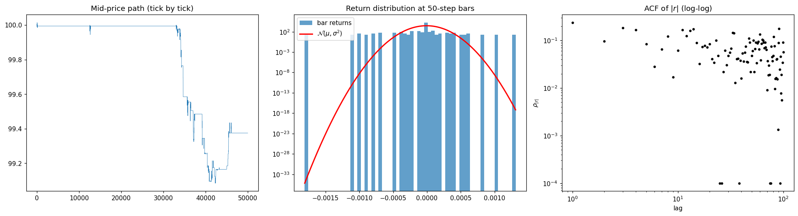

# 模块 6 · 微观结构与订单簿 —— 价格是怎么生成的

> "Price impact is the most important quantity in market microstructure, and it is approximately square root."
> —— Bouchaud, Bonart, Donier & Gould, *Trades, Quotes and Prices* (2018)

2000 年代初的某个时间，Capital Fund Management 巴黎办公室。Bouchaud 和他的合作者（Mastromatteo、Tóth、后来还有 Donier）开始系统处理 CFM 自己积累的执行数据——一笔大单（几万到几百万股）被算法拆开分散执行，他们关心的问题是：**冲击成本到底如何依赖于订单规模 $Q$？** 教科书里的线性响应理论说 $\Delta p \propto Q$，Kyle 1985 的模型给出同样的线性。他们的预期是看到一个跟资产、跟市场状态、跟时间尺度都明显有依赖的函数族——不同的股票应该有不同的冲击曲线。让他们震惊的是，把所有数据用 $Q/V$（$V$ 是日均成交量）做归一化，然后画 $\Delta p / \sigma_d$，**所有股票、所有日子、所有市场坍缩到同一条曲线上，而且这条曲线是 $\sqrt{Q/V}$**。这件事的稳定性让 Bouchaud 后来在一篇综述里写："在我们做过的所有金融经验研究里，square-root impact 是 robust 性最高的一条。"接下来的十年里，Bouchaud–Farmer–Lillo–Mastromatteo 几代人都在尝试解释为什么是平方根而不是别的——这是这一章主线。

前五模块都把"价格"当成给定的时间序列在分析。这模块下到**机器细节**：价格不是从天上掉下来的，它是限价单簿（Limit Order Book， LOB）被一个个订单驱动出来的。我们要拆开这个机器，看看里面有哪些 robust 的经验规律——以及为什么这些规律和"近临界"、"重尾"、"长程相关"等之前的主题不约而同地呼应。

读完本模块后，你应该能：

1. 描述限价单簿的基本结构（bid/ask 队列、市价单 vs 限价单 vs 撤单）
2. 写出 **square-root impact law** 并解释为什么它对量化执行至关重要
3. 解释订单流自相关的长程性，以及为什么这件事和"市场是有效的"看似矛盾
4. 用 Python 跑一个简单的零智能（zero-intelligence）LOB 模拟，看看哪些 stylized facts 自然涌现

---

## 6.1 限价单簿 101

任何流动的电子市场（NYSE、Nasdaq、Binance……）的底层结构是 **限价单簿（LOB）**：一个买方报价队列（bids）和一个卖方报价队列（asks），按价格优先、时间优先排序。

三类基本动作：

| 动作 | 效果 |
|---|---|
| **限价单（limit order）** | 在簿子上挂一个 quote，等被吃 |
| **市价单（market order）** | 立即吃掉对手方最优档 |
| **撤单（cancellation）** | 把自己挂的单撤回来 |

定义：

- **最优买价 $b_t$**：bid 队列的最高价
- **最优卖价 $a_t$**：ask 队列的最低价
- **mid-price** $m_t = (a_t + b_t)/2$
- **bid-ask spread** $a_t - b_t$，刻画即时流动性成本
- **市场深度（depth）**：某档价位上的总挂单量

主流 quant 通常用 mid-price 做收益率分析，虽然实际成交会有 spread 损耗。

---

## 6.2 Square-root impact law

如果你想买 $Q$ 股，市场会朝你不利的方向走多少？这就是**价格冲击（price impact）**。经验事实极其干净：

$$
\Delta p \approx Y \cdot \sigma_d \cdot \sqrt{\frac{Q}{V}}
$$

其中 $\sigma_d$ 是日波动率，$V$ 是日均成交量，$Y$ 是 $O(1)$ 的常数（经验上 $Y \approx 0.5$–1）。

**关键性质**：

1. **平方根**而非线性。你交易量翻 4 倍，冲击只翻 2 倍——大单的"边际冲击"递减。
2. **不依赖资产、不依赖市场、不依赖时间尺度**。从美股到加密、从分钟到一整天，$\sqrt{Q/V}$ 这条曲线惊人地稳定。
3. **与一阶反应理论的"线性响应"严重相悖**——线性响应预测 $\Delta p \propto Q$，平方根说 $\Delta p \propto \sqrt Q$。

**为什么是平方根**：这是机制争议最大的开放问题。两条主要解释：

- **Latent liquidity（隐藏流动性）/ Donier–Bouchaud**：LOB 的可见挂单只是冰山一角，真实的"潜在供给曲线" $\rho_{\text{latent}}(p)$ 在中心区域**线性增长**。把 $Q$ 量从底部"刮过去"消耗的价格差正是 $\sqrt Q$ 的几何积分结果。
- **拍卖机制 / Almgren-Chriss / Kyle**：在 Kyle （1985） 框架下，平方根冲击是"信息交易者最优拆单"的均衡结果。但这要求一些精巧的假设。

实务上，**平方根冲击 = 量化执行的圣经**。算法交易把大单拆成小单沿一天分布，用 $\sqrt{Q/V}$ 估冲击成本，VWAP、TWAP、IS 这些经典执行算法都建在这条规律上。

值得在这里停一下，处理一件物理学读者会迟早问出来的事：**两种 candidate 机制（Kyle 信息最优 vs 隐藏流动性几何）解释同一条 √ 曲线，实证上能区分吗？** 经验上的答案是：**目前为止，基本不能**。两种机制对 meta-order 期间的冲击形状、对 meta-order 结束后的回归速度、对跨资产的常数 $Y$ 的微小差异，都给出量级上相同的预测。这种"universality 超出了理论的辨识能力"的情形，在物理学里其实不罕见——临界指数的 universality 在 1970 年代是先被实验测出来的（液氦的 $\lambda$-transition、铁磁体的 Curie 点都给出相同的指数），然后 Wilson 1972 的 renormalization group 才把这件事推导出来。**经验的 universality 经常领先于机制的辨识** ，这是物理学过去七十年反复出现的模式。Square-root impact 现在的状态，就是经验 universality 已经在工业里被产线化使用，但底层机制还在 Kyle / 隐藏流动性 / mean-field game 几条候选之间没有定论。如果你受过物理训练，这种状态应该是熟悉的，**不应该被读成"机制不清就是 econophysics 不严谨"**——这是 universality-first 的研究路径的常态。

---

## 6.3 订单流的长程相关

观察买/卖标记序列 $\varepsilon_t \in \{+1, -1\}$（$+1$ 表示市价买单，$-1$ 卖单）。直觉上，如果市场有效，$\varepsilon_t$ 应该接近独立——否则你可以预测下一笔单是买是卖，套利掉。

**经验事实**：订单流的自相关 $\rho_\varepsilon(\tau)$ 以**幂律**衰减，$\tau$ 高达上千笔订单时仍显著正：

$$
\rho_\varepsilon(\tau) \sim \tau^{-\gamma_\varepsilon}, \quad \gamma_\varepsilon \approx 0.5
$$

这意味着订单流**有长程记忆**——但价格本身的自相关接近 0。这两件事怎么共存？

**Bouchaud–Farmer–Lillo 的解答**：订单流的可预测性被市场的**反向反应**抵消了。每笔买单造成正向价格冲击，但**后续的反向冲击**（$\varepsilon_{t+1} = -1$ 也好，自身的市价回归也好）平均把它打平。形式化为：

$$
\Delta p_t = G_0 \varepsilon_t + \text{反向项}
$$

其中反向项的形式恰好保证 $\mathrm{Cov}(\Delta p_t, \Delta p_{t+\tau}) \approx 0$ 即使 $\varepsilon_t$ 高度相关。这是 econophysics 在微观结构最优雅的结果之一。

**机制**：大单被算法拆成上千笔小单，沿几小时甚至一整天分散执行——这就**自然产生了订单流的长程相关**，而做市商的反应又**自然抵消了价格的可预测性**。

把这件事用具体数字落地。一只机构买家拿到任务"在今天买入 5000 万美元的 AAPL"——以 AAPL 平均成交量 （$V \sim 1$ 亿股、$\sigma_d \sim 1.5\%$、股价 $\sim 200$ 美元算） 来估，这是大约 25 万股，$Q/V \approx 0.0025$，对应 square-root 冲击在 $0.75\%$ 量级——也就是 $\sim 38$ 万美元的冲击成本。执行算法（VWAP、TWAP、Implementation Shortfall、Arrival Price 等）会把这 25 万股**拆成几千到上万笔子订单**，沿当天的交易时段按某种分布执行：VWAP 按历史成交量分布拆，TWAP 按时间均匀拆，IS 在"等待节省冲击"和"价格漂移风险"之间权衡。每一笔子订单都是同向的（都是买），且时间上紧挨着——这就在订单流序列 $\varepsilon_t$ 上**直接生成长程正相关**。如果一天有几百笔这种 meta-order 被几百个不同的机构同时拆单执行，$\rho_\varepsilon(\tau) \sim \tau^{-0.5}$ 这条经验规律就是这种集体行为的统计指纹。换句话说，订单流的长程记忆**不是市场内在的奇异统计性质，是算法交易实际形态的直接结果**。

---

## 6.4 做市与库存问题

**做市商（market maker）** 同时挂买价和卖价，赚 spread，但承担**库存风险（inventory risk）**：如果你刚买了一堆，价格立刻往下走，你亏。

经典模型 **Avellaneda–Stoikov （2008）**：做市商的最优报价是

$$
b^* = m_t - \delta^b(I_t), \quad a^* = m_t + \delta^a(I_t)
$$

其中 $\delta$ 不仅依赖于市场状态，还依赖于做市商**当前库存 $I_t$**。库存正（已经持有过多）时，$\delta^a$ 缩小、$\delta^b$ 扩大——主动把库存推出去。

这给出了**spread 随波动率上升**的微观机制：波动率高 → 库存风险高 → 做市商要更宽的 spread 补偿。模块 3 的"波动率聚集"在 LOB 上对应"spread 聚集"。

Avellaneda–Stoikov 这个简洁模型有一个**临界失效模式**——当 $\sigma$ 跳得足够快、足够大时，最优 $\delta$ 在公式上趋向无穷，做市商的最优行动是**完全退出**。这件事在 2010 年 5 月 6 日 Flash Crash 里看到了它的实际形态：下午 14：42 到 14：47 之间，Dow 在五分钟里下跌约 9%，主要的几个 HFT 做市商在事后报告里都承认**他们的算法在那个时段把报价撤离了**——不是出于恐慌，是出于风控参数的硬约束：当瞬时波动率超过历史 5σ，做市商发布的报价宽度按 Avellaneda–Stoikov 类公式会发散，实操上对应停止挂单。然后这件事是**自我强化的**：做市商一退，流动性变薄，价格在没有买盘的真空里继续下落，波动率进一步上升，更多做市商退出。SEC/CFTC 2010 年 9 月 30 日联合报告对这个反馈链做了完整的时间戳重建。这件事的物理学读法是：**库存模型的"最优行动"在尾部参数区间不连续——一个连续的 $\sigma$ 增大可以触发不连续的"退场"决策**。模块 5 的"近临界"在 LOB 这一层就长这个样子。

---

## 6.5 实战：Python Lab —— 零智能 LOB 模拟

最简单的 LOB 模型（Smith–Farmer–Gillemot–Krishnamurthy 2003）：每个 tick 上，在某个价位以泊松概率提交限价单 / 市价单 / 撤单，**所有决策是纯随机的**。这就是"零智能"。

```python
import numpy as np
import matplotlib.pyplot as plt
from collections import defaultdict
from scipy import stats
from statsmodels.tsa.stattools import acf

class LOB:
    def __init__(self, mid=100.0, tick=0.01, depth_init=5):
        self.tick = tick
        self.bids = defaultdict(int)
        self.asks = defaultdict(int)
        for k in range(1, 30):
            self.bids[round(mid - k*tick, 2)] = depth_init
            self.asks[round(mid + k*tick, 2)] = depth_init

    def best_bid(self): return max(self.bids) if self.bids else None
    def best_ask(self): return min(self.asks) if self.asks else None
    def mid(self):
        b, a = self.best_bid(), self.best_ask()
        if b is None or a is None:
            return self._last_mid if hasattr(self, "_last_mid") else 100.0
        self._last_mid = 0.5 * (b + a)
        return self._last_mid

    def submit_limit(self, side, price):
        book = self.bids if side == "buy" else self.asks
        book[round(price, 2)] += 1

    def submit_market(self, side, size=1):
        # Walk up to `size` shares through the book.
        traded = 0
        notional = 0.0
        book = self.asks if side == "buy" else self.bids
        pick = min if side == "buy" else max
        while traded < size and book:
            p = pick(book)
            take = min(size - traded, book[p])
            book[p] -= take
            if book[p] == 0: del book[p]
            notional += take * p; traded += take
        return notional / traded if traded > 0 else None

    def cancel(self, side):
        book = self.bids if side == "buy" else self.asks
        if not book: return
        p = np.random.choice(list(book.keys()))
        book[p] -= 1
        if book[p] == 0: del book[p]

np.random.seed(0)
lob = LOB()
mids, trades = [], []
rate_limit, rate_market, rate_cancel = 0.55, 0.20, 0.25

for t in range(50000):
    side = np.random.choice(["buy", "sell"])
    u = np.random.rand()
    if u < rate_limit:
        # Limit orders sit at the same-side touch and shift up to 4 ticks INTO
        # the spread (toward the opposite touch). Clamped to one tick inside
        # the opposite side so they don't cross the book.
        offset = np.random.choice([0, 0, 1, 2, 3, 4]) * lob.tick
        ref = lob.best_bid() if side == "buy" else lob.best_ask()
        if ref is None:                       # book empty on this side
            ref = lob.mid()
        price = (ref + offset) if side == "buy" else (ref - offset)
        opp = lob.best_ask() if side == "buy" else lob.best_bid()
        if opp is not None:
            if side == "buy" and price >= opp:  price = opp - lob.tick
            if side == "sell" and price <= opp: price = opp + lob.tick
        lob.submit_limit(side, price)
    elif u < rate_limit + rate_market:
        # Variable-sized market orders: occasional bursts walk multiple levels
        size = int(np.random.choice([1, 1, 2, 3, 5], p=[0.45, 0.25, 0.15, 0.10, 0.05]))
        p = lob.submit_market(side, size=size)
        if p is not None: trades.append((t, p, side, size))
    else:
        lob.cancel(side)
    mids.append(lob.mid())

mids = np.array(mids)
# Coarse-grain to bars so each return mixes many micro-events
bar = 50
mid_bar = mids[bar - 1::bar]
r = np.diff(np.log(mid_bar))

fig, axes = plt.subplots(1, 3, figsize=(18, 5))
axes[0].plot(mids, lw=0.5); axes[0].set_title("Mid-price path (tick by tick)")
axes[1].hist(r, bins=60, density=True, alpha=0.7, label="bar returns")
mu, sd = r.mean(), r.std()
xs = np.linspace(r.min(), r.max(), 200)
axes[1].plot(xs, stats.norm.pdf(xs, mu, sd), "r-", lw=2, label=r"$\mathcal{N}(\mu, \sigma^2)$")
axes[1].set_yscale("log"); axes[1].legend()
axes[1].set_title(f"Return distribution at {bar}-step bars")

acf_abs = acf(np.abs(r), nlags=100, fft=True)[1:]
axes[2].loglog(np.arange(1, 101), np.maximum(acf_abs, 1e-4), "k.")
axes[2].set_title(r"ACF of $|r|$ (log-log)")
axes[2].set_xlabel("lag"); axes[2].set_ylabel(r"$\rho_{|r|}$")

plt.tight_layout()
plt.show()
```

跑出来的数字（`scripts/m06.py`）：

```text
#trades = 9991 / 50000 steps; #bars = 1000
mid: min = 99.085, max = 100.015, range = 0.930
bar return: std = 0.00013, kurtosis = 62.09
ACF(|r|) at lag 1, 5, 20, 50 = 0.238, 0.084, 0.085, 0.048
```



照着图和数字读：

- **左：中价路径**——大部分时间在 100.0 附近 jitter，但在 t≈30k 附近出现近 1 元的"无理由"暴跌——所有微观决策都是随机的，**宏观大幅波动自发涌现**
- **中：bar 收益率分布**——蓝色直方图明显比红色高斯外延更远，峰度 62（高斯=0）——**重尾自发涌现**，只靠纯随机的零智能 agent
- **右：$|r|$ 的 ACF**——lag 1 是 0.24，衰减到 lag 50 仍有 0.05——有一定波动率聚集，但比真实股票数据（60 个 lag 仍是 0.3）弱得多

> ⚠️ 调参注意：tick 离散化是这个模型的麻烦源——单步 mid 变化只能是 0、±½tick、±1tick…所以**必须把收益率粗化（bar=50 步聚合）**，否则直方图退化成几根离散棒，看不出尾部。这是教学版的代价。
> 此外，初始 depth、limit-offset 分布、market-order 尺寸分布都是手动平衡过的：depth_init 太大、order 都 size=1 时，price 一动不动；depth_init 太小、market burst 太频繁，book 直接被打穿。**SFGK 原文用连续价格+泊松到达率绕开了这个，但教学上 tick 版更直观**。

这个模型复现了重尾，但波动率聚集只是雏形——这正引出模块 7：为什么 ABM 要加进异质 agent。

---

## 6.6 常见误解

- **"square-root 冲击适用于所有大小的单"**——很大（$Q/V > 0.1$）和很小（$Q$ 几股）的极端都偏离 $\sqrt{}$。中段 $Q/V \in [10^{-4}, 10^{-1}]$ 是 robust 的。
- **"订单流相关 = 可以预测价格"**——错。Bouchaud 等人的反向反应理论正好解释为什么订单流可预测但价格不可预测。
- **"做市就是稳赚"**——库存风险、逆向选择（有信息的对手吃你）、监管风险都很真实。LTCM 之后做市集中在少数有规模的电子做市商手里。
- **"高频交易加剧波动率"**——证据混合。HFT 通常**降低**正常时段 spread，但在压力时段流动性退场，可能放大瞬间崩盘（2010 闪崩）。
- **"LOB 模型只是 toy"**——零智能 LOB 已经能复现重尾、自相关结构。完整解释需要 Donier 的 latent liquidity 模型或类似框架。

---

## 6.7 章末小结与延伸

### 本模块核心回顾

1. **LOB 是价格的底层机器**：三类动作（limit/market/cancel）在简单规则下竞争出 bid/ask、深度、spread。
2. **Square-root impact** 是 econophysics 在微观结构最 robust、最 universal 的经验定律，机制至今争议。
3. **订单流长程相关 + 价格不可预测**的悖论被反向反应理论优雅地解开——大单拆单造成订单流记忆，做市商反应抵消价格记忆。
4. **做市商的 inventory 问题**给 spread 和波动率提供了微观机制：spread $\propto$ 波动率，因为 $\propto$ 库存风险。
5. **零智能 LOB** 已经能自发产生重尾，但完整 stylized facts 需要更复杂模型——通向模块 7 的 ABM。

### 习题

#### 习题 6.1（简单）

你要在一天内买 100 万股某只股票（$V = 1000$ 万股/天，$\sigma_d = 1\%$）。用 $Y = 1$ 的 square-root law 估计冲击成本（以 bp 计）。

#### 习题 6.2（中等）

为什么 $\Delta p \propto Q$ 这种线性响应理论在 LOB 上失败？用 latent liquidity 的"线性供给曲线"画一画。

#### 习题 6.3（中等，需跑代码）

跑 6.5 节零智能 LOB 模拟。

（a） 把 `rate_market` 从 0.15 调到 0.3，价格路径和重尾如何变化？
（b） 加进一个"meta-order"：在某个时间窗内只让模型提交 `buy` 市价单，看 mid-price 怎么响应——是不是大致 $\sqrt{Q/V}$ 的形状？

#### 习题 6.4（开放）

如果你设计一个新交易所，会保留 LOB 这种连续撮合机制，还是用 **periodic batch auction**（每秒撮合一次）？各自的优劣？

### 延伸阅读

**必读：**

- Bouchaud, J.-P., Bonart, J., Donier, J., & Gould, M. (2018). *Trades, Quotes and Prices*. Cambridge. —— LOB 经验研究的圣经。
- Bouchaud, J.-P., Gefen, Y., Potters, M., & Wyart, M. (2004). "Fluctuations and response in financial markets." *Quantitative Finance*, 4(2). —— 反向反应理论起点。

**值得翻：**

- Almgren, R., Thum, C., Hauptmann, E., & Li, H. (2005). "Direct estimation of equity market impact." *Risk*, 18.
- Smith, E., Farmer, J. D., Gillemot, L., & Krishnamurthy, S. (2003). "Statistical theory of the continuous double auction." *Quantitative Finance*, 3.
- Donier, J., Bonart, J., Mastromatteo, I., & Bouchaud, J.-P. (2015). "A fully consistent, minimal model for non-linear market impact." *Quantitative Finance*, 15(7).

**进阶：**

- Avellaneda, M., & Stoikov, S. (2008). "High-frequency trading in a limit order book." *Quantitative Finance*, 8(3).
- Lehalle, C.-A., & Laruelle, S. (2018). *Market Microstructure in Practice*.

---

### 下一模块预告

LOB 是微观机器，但每个订单背后是**有目的的 agent**——做市商、套利者、信息交易者、噪声交易者。模块 7 进入 **agent-based models（ABM）**：从 minority game、heterogeneous agents 等简单模型出发，看异质性如何涌现出市场的 stylized facts。

---

> **本模块一句话总结**
>
> Square-root impact、订单流长程相关 + 价格不可预测、spread ∝ 波动率——这三条 robust 的微观规律是 LOB 这台机器在简单交互下涌现出来的，而它们和前面模块的"重尾"、"波动率聚集"、"近临界"主题高度一致。

---

## 📝 学习记录

| 项 | 内容 |
|---|---|
| 起始日期 | |
| 完成日期 | |
| 卡点 | |
| 关键收获 | |
| 配套代码仓库链接 | |
