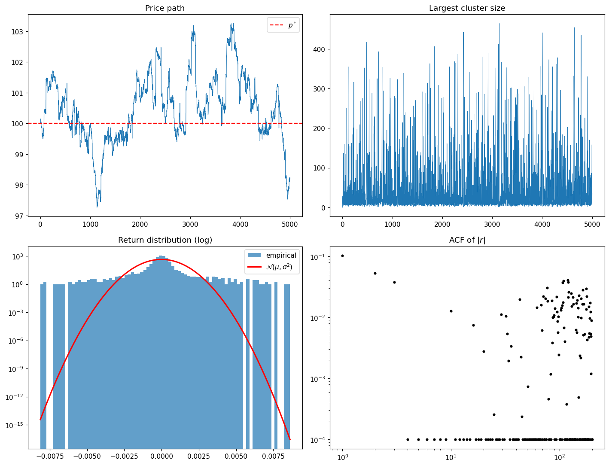

# 模块 7 · ABM 与涌现 —— 从异质 agent 到宏观规律

> "Agent-based models are to economics what statistical mechanics was to thermodynamics: a microfoundation for macro behavior."
> —— J. Doyne Farmer (paraphrased, Santa Fe Institute lecture)

1997 年，瑞士 Fribourg 大学物理系。Damien Challet 是 Yi-Cheng Zhang 的博士生，两人正在设计一个尽可能简单的 toy model 来研究"协调与博弈"。规则被打磨到了几乎不可再减：**$N$ 个 agent（奇数），每轮独立选 $\pm 1$，赢的是少数派**——如果整体多数选 $+1$，则选 $-1$ 的人赢。没有价格、没有信息、没有任何金融元素，agent 也不学高深的策略，只在几个简单的"过去 $m$ 步信息 → 现在选什么"的查找表之间根据得分切换。让 Challet 和 Zhang 自己也意外的是，这个最简模型跑出来的"赢家比例"时间序列——本质上是一个一维信号——**自发地表现出重尾分布和波动率聚集**，这两件事正好是真实金融数据上最 robust 的两条 stylized facts。Minority Game 由此发表在 *Physica A* 246。这件事在 1997 年的物理学语境下是个挑衅——你不需要复杂的微观假设、不需要理性预期、不需要市场出清，简单的**异质 + 适应**就足以涌现出与真实金融数据高度相似的统计形态。这一章的核心论证骨架，就是这件事。

模块 2–4 我们用统计工具刻画了**宏观 stylized facts**：重尾、波动率聚集、协方差谱。模块 5–6 我们看到这些事实在**机制层面**（临界现象、LOB）有部分解释。但还有一个层级没碰：**异质交易者之间的交互**。这模块用 agent-based models（ABM）把这一层补上，看看从简单的微观规则出发，宏观规律能否自然涌现。

读完本模块后，你应该能：

1. 描述 ABM 在科学方法论上的位置（和 DSGE、自顶向下的均衡模型对比）
2. 写出 Minority Game 的基本规则，解释为什么它的"集合行为"在某个参数区间产生重尾
3. 解释 heterogeneous agents（基本面派 vs 趋势派）模型如何**同时**给出重尾、波动率聚集、bubble-and-crash
4. 用 Python 跑一个简单 ABM，看几个 stylized facts 是否自发涌现

---

## 7.1 ABM 在科学方法论上的位置

主流经济学的核心是 **DSGE（Dynamic Stochastic General Equilibrium）** 这一脉：**代表性 agent**、理性预期、市场出清的方程系统。批评点很多，核心一条：**代表性 agent = 没有交互**，但市场是异质交易者交互的产物。

ABM 是反方向的：**从异质 agent 的局部规则出发，涌现出宏观行为**。这和统计物理的步骤完全一样——从分子的微观相互作用，涌现出温度、压强、相变。

| 维度 | DSGE | ABM |
|---|---|---|
| Agent | 代表性（homogeneous) | 异质（heterogeneous) |
| 预期 | 理性（rational expectations） | 适应性（adaptive） / 学习 |
| 均衡 | 闭式不动点 | 涌现的动态（可能多稳态） |
| 验证 | 内部一致性 + 部分实证 | stylized facts 复现度 |
| 数学 | 优化 + 动态规划 | 模拟 + 统计 |

**ABM 不是"DSGE 的替代"，更准确说是 DSGE 假设的检验台**。在某个 ABM 里，如果你强迫所有 agent 同质 + 理性，你应该回到 DSGE 预测；如果你放松到异质，会涌现出 DSGE 抓不到的现象（重尾、危机、多稳态）。

ABM 的几个标准批评（中肯的）：

1. **参数太多，容易过拟合**——同样的 stylized facts，不同 ABM 都能复现，等于没证伪
2. **校准困难**——agent 数量、规则参数、初始条件，组合空间巨大
3. **机制 vs 拟合**——拟合好不等于机制对

模块 8 会回到这些批评，讨论"宏观本构关系"作为 ABM 简化的方向。

---

## 7.2 Minority Game：最小的 ABM

Challet–Zhang（1997）的 **Minority Game （MG）** 是 ABM 历史上最简洁的模型。规则：

- $N$ 个 agent（奇数），每轮选 $\pm 1$
- **赢的是少数派**（因此叫 minority）。如果整体多数选 $+1$，选 $-1$ 的赢
- 每个 agent 有 $s$ 个**策略**（从过去 $m$ 步信息映射到当前选择的函数表），每轮用得分最高的那个

这个模型的天才之处：**没有信息，没有理性，只有简单规则**，却涌现出价格序列的 stylized facts。

### 7.2.1 MG 的关键现象

定义**控制参数** $\alpha = 2^m / N$（$m$ 是记忆长度，$N$ 是 agent 数）。系统行为有三个区间：

- **$\alpha \gg 1$**：agent 多过策略空间，行为接近随机——市场无效率反而最强（可预测性最高）
- **$\alpha \approx \alpha_c$**（典型 $\alpha_c \approx 0.3$）：**临界相变**。涨落 $\sigma^2(\alpha)/N$ 有极小值，系统对参数最敏感
- **$\alpha \ll 1$**：agent 太多，策略相互抵消，涨落大，但价格相对可预测性低

在临界点附近，价格序列**自发产生重尾、波动率聚集** —— 而这正是我们在 S&P 500 上看到的！

**这是 econophysics 一个标志性论证**：复杂的 stylized facts 不需要"复杂"的微观假设，简单的**异质 + 适应**就够。

---

## 7.3 Heterogeneous Agents：基本面派 vs 趋势派

更接近现实的 ABM 通常包含两类 agent：

- **Fundamentalists**：相信存在一个"基本面价格"$p^*$，当 $p_t < p^*$ 时买入，$p_t > p^*$ 时卖出。这是稳定力量。
- **Chartists / Trend-followers**：相信"趋势会延续"，过去几天涨过则买，跌过则卖。这是放大力量。

经典模型（Lux 1995， Brock & Hommes 1998）用一个**切换机制**——agent 根据近期收益在两类之间切换。结果：

- 当趋势派占优，价格被推离基本面 → bubble
- 偏离够大时基本面派回归吸引力大，趋势派**集体切换** → crash
- 这个切换是**非线性**的，产生**多稳态**和**波动率聚集**

**关键洞察**：重尾、波动率聚集、bubble-and-crash **同时涌现**，不需要外部冲击。这比单独建模一个 stylized fact 强得多。

Bouchaud 等人后来发展出 "**herding + reference price**" 的连续版本，在订单簿层面复现 square-root impact + 长程相关——把模块 6 的微观结构和模块 7 的 ABM 缝起来。

基本面派/趋势派的异质性，在金融经济学这一侧对应一整条反身性文献：Keynes（1936 ch.12）的 beauty contest——agent 推理"别人怎么推理"——Soros（1987）的 reflexivity、Minsky（1986）的金融不稳定假说、Lo（2017）的 adaptive markets hypothesis。这些不是 econophysics 的外部批评，而是 ABM 在 agent 层把同一件事——self-referential 动力学——写成制度史语言的版本。模块 8 §8.1 给出统一框架。

值得把这条文献链稍微展开，因为它在中文 econophysics 材料里几乎从来不被引，但它和 ABM 是一件事的两端。Keynes 1936 年 *General Theory* 第 12 章那段著名的 beauty contest 类比——"成功的投资者不是猜哪个面孔最美，而是猜其他人猜哪个面孔最美"——在 1936 年是一个对效率市场假说还没出生的预先反驳。Hyman Minsky 1986 年 *Stabilizing an Unstable Economy* 把这条思路推到宏观层面，提出"稳定本身是不稳定的"——长期繁荣使 agent 类型分布漂移，从对冲型滑向投机型再滑向庞氏型，系统因此内生地走向危机。George Soros 1987 年 *The Alchemy of Finance* 用"reflexivity"这个词把同样的思路写成一个交易员的实战哲学。Andrew Lo 2017 年 *Adaptive Markets* 把这套整合成 adaptive markets hypothesis——一个把 EMH 和行为金融在演化框架下统一起来的尝试。这条线在 80 年里几乎没有进入主流金融经济学的核心课程，原因不是没人懂，而是它无法被装进 DSGE 的代表性 agent + 理性预期框架。**ABM 是这条线在数学上的形式化**——把 Keynes、Minsky、Soros、Lo 各自用语言陈述的 self-referential 动力学，在 agent 层用具体的微观规则写出来。Bouchaud 几代人引用 Keynes 的频率比一般金融博士还高，不是偶然。

---

## 7.4 ABM 对主流范式的真正挑战

ABM 真正动摇主流经济学的不是"DSGE 错了"，而是：

1. **市场可以长期偏离均衡**——非线性反馈下"基本面价格"不一定收敛
2. **危机不需要外部冲击**——内生的羊群切换就够。2008 不一定是"次贷的外生冲击"，可能只是某个均衡不稳定性的实现
3. **代表性 agent 假设系统性低估尾部风险**——同质性消灭了集体切换这个机制，VaR 计算反而比 ABM 低
4. **政策影响通过"agent 类型分布"传导**，而不是通过"代表性 agent 的优化"——央行 forward guidance 在 ABM 框架下可以引起 agent 分布漂移

第二点值得用 2008 作具体案例做出来。主流叙事：次贷违约率上升是**外生冲击**，通过 CDO 结构和银行间敞口传导到全球金融系统，最终引发 Lehman 倒闭和系统性危机。这套叙事承认传染、承认放大，但把触发归到"外面"——subprime 是个 exogenous shock。ABM 视角下的另一套叙事：在 2002–2007 这五年里，美国金融系统的 agent 类型分布**内生地**漂移——投机型 agent（用短期同业回购融资买长期 MBS）的比例上升、对冲型 agent（传统商行）的比例下降、整个系统的杠杆和久期错配同步增长。在这种分布下，**任何足够小的扰动都会触发级联**——subprime 违约率从 6% 升到 10% 这个量级的事件，在 2002 年的 agent 分布下系统能吸收掉，在 2007 年的 agent 分布下不行。Haldane 自己在多篇论文里写过这个判断（"the system was the bomb， the subprime was just the trigger"）； Minsky 在他 1986 年那本书里几十年前就预测过这种"长期稳定本身导致结构性脆化"的图像。**哪套叙事对？** 我倾向后者，因为它能解释为什么 subprime 这种量级的事件——历史上美国住房市场出现过多次类似规模的违约率上升——这一次造成了系统性后果而其他时候没有。如果你只接受外生冲击的解释，你需要一个理由说明 2008 这次 subprime 在量级上比之前的违约事件特殊。我没找到这个理由——也没看到过谁给出过。

后两点是 2008 后被各大央行（尤其英格兰银行）严肃看的方向。Andy Haldane 2012 年那篇讲话直接呼吁把 ABM 纳入金融稳定监测。

值得在这里多说一句 Haldane 这一系列讲话。Andrew Haldane 在 2012 年前后是英格兰银行金融稳定执行董事——一连串面向政策圈的讲话（包括关于金融网络拓扑、系统性风险与异质 agent 建模的几篇）中，他是央行级别的政策人物**公开**认领 agent-based modeling 作为系统性风险监测工具的标志人物。在 Haldane 之前，ABM 在金融政策圈基本属于"圣塔菲研究所的东西"——意思是有意思，但不在主流央行的工具箱里。Haldane 这场讲话之后，BoE、ECB、IMF 都启动了 ABM × 金融稳定的内部工作组，RAMSI 这类系统级 stress test 框架开始把异质 agent 类型分布纳入测试设计。这件事的意义不在 ABM "证明了自己"，而在政策制定者主动承认 **代表性 agent 框架在 2008 前低估尾部风险**——而 Haldane 的判断是，这种低估是结构性的、不是参数误调可以救的。从 2012 到现在，这条线已经从"试点"变成"常规"， econophysics 在政策层面最大的真实开口就是这条。

---

## 7.5 实战：Python Lab —— Cont–Bouchaud 群聚模型

最小可工作的 ABM 不是基本面派 vs 趋势派（那种 fitness-based 切换很难调出来稳定的羊群），而是 **Cont–Bouchaud 2000** 的群聚模型：N 个交易者随机两两合并成"信息簇"，每个簇集体决定买、卖或观望。簇大小分布的重尾**直接**给出价格收益率的重尾。

```python
import numpy as np
import matplotlib.pyplot as plt
from scipy import stats
from statsmodels.tsa.stattools import acf

np.random.seed(7)
T = 5000
N = 500
a = 0.30            # 每步每簇活跃概率(否则观望)
p_merge = 0.0003    # 每对每步合并率
p_split = 0.40      # 每簇每步解散率
lam = 0.01          # 单位净订单的价格冲击
p_star = 100.0
p = np.zeros(T); p[0] = p_star
fund_pull = 0.001   # 对基本面价的微弱回拉

# 初始:每个 trader 自成一簇
cluster_of = np.arange(N)
biggest_cluster = np.zeros(T, dtype=int)

for t in range(1, T):
    # 1) 随机合并
    n_merge_trials = max(1, int(p_merge * N * N))
    for _ in range(n_merge_trials):
        i, j = np.random.randint(0, N, 2)
        ci, cj = cluster_of[i], cluster_of[j]
        if ci != cj:
            new, old = (ci, cj) if ci < cj else (cj, ci)
            cluster_of[cluster_of == old] = new

    # 2) 随机解散
    for c in np.unique(cluster_of):
        if np.random.rand() < p_split:
            members = np.where(cluster_of == c)[0]
            cluster_of[members] = members

    # 3) 每簇集体决策:(-1, 0, +1),概率 (a/2, 1-a, a/2)
    net = 0.0
    for c in np.unique(cluster_of):
        u = np.random.rand()
        decision = -1 if u < a/2 else (+1 if u < a else 0)
        if decision:
            net += decision * np.sum(cluster_of == c)

    # 4) 价格更新
    drift = -fund_pull * np.log(p[t-1] / p_star)
    p[t] = p[t-1] * np.exp(lam * net / N + drift)
    biggest_cluster[t] = max(np.bincount(cluster_of)[np.bincount(cluster_of) > 0])

r = np.diff(np.log(p))

fig, axes = plt.subplots(2, 2, figsize=(13, 10))
axes[0,0].plot(p, lw=0.8); axes[0,0].axhline(p_star, color="r", ls="--", label=r"$p^*$")
axes[0,0].set_title("Price path"); axes[0,0].legend()

axes[0,1].plot(biggest_cluster, lw=0.6); axes[0,1].set_title("Largest cluster size")

axes[1,0].hist(r, bins=80, density=True, alpha=0.7, label="empirical")
mu, sd = r.mean(), r.std()
xs = np.linspace(r.min(), r.max(), 200)
axes[1,0].plot(xs, stats.norm.pdf(xs, mu, sd), "r-", lw=2, label=r"$\mathcal{N}(\mu, \sigma^2)$")
axes[1,0].set_yscale("log"); axes[1,0].legend()
axes[1,0].set_title("Return distribution (log)")

lags = np.arange(1, 201)
acf_abs = acf(np.abs(r), nlags=200, fft=True)[1:]
axes[1,1].loglog(lags, np.maximum(acf_abs, 1e-4), "k.")
axes[1,1].set_title(r"ACF of $|r|$")

plt.tight_layout()
plt.show()
```

跑出来的数字（`scripts/m07.py`，约 15 秒）：

```text
price: min = 97.27, max = 103.25, mean = 100.49
largest cluster: time mean = 46.6, max = 464
return: std = 0.00092, kurtosis = 25.91
ACF(|r|) at lag 1, 10, 50, 100 = 0.103, 0.013, -0.016, -0.011
```



四张图正好把四个 stylized facts 一次性呈现：

- **左上：价格路径**——围绕 $p^*=100$ 波动，偶尔形成 1–3 元的小型 bubble 然后被回拉（基本面拉力作用）
- **右上：最大簇大小**——大部分时间在 50 以下，但**偶发尖峰冲到 400+**，说明簇大小服从重尾分布（percolation 标志）
- **左下：收益率分布**——经验直方图（蓝）在 ±0.005 处密度还有 0.1，而同方差高斯（红）在那里只有 $10^{-9}$，峰度 **25.9**（高斯=0）——这是经济物理学讲了 30 年的"重尾自发涌现"
- **右下：$|r|$ 的 ACF**——lag 1 是 0.10，有一定持续性，但比真实股票数据（0.3 量级）弱——这个模型擅长重尾，弱于聚集

> 调参直觉：`p_split / p_merge` 决定簇大小分布的位置。比值太大，所有簇都很小，系统退化成 N 个独立 agent → 中心极限定理压尾；比值太小，系统坍缩成一个大簇 → 每步全员同向 → 价格漂移而非震荡。当前比值在亚临界区，簇大小幂律地出现，重尾就自动出现。**这种"用统计物理的相变定位现象"是 econophysics 最物理学家的思路**。

把这里的物理内容说穿：Cont–Bouchaud 的簇是**协调一致的信念态**，percolation 相变是**情绪相位锁定**，簇大小的幂律分布就是信念分布的幂律。本书里这是 agent 层最干净的第三寄存器范例——状态变量是信念，动力学是传染。模块 8 §8.1 给出统一框架。

四个 stylized facts（bubble、簇切换、重尾、聚集）**从同一个最小模型涌现**——这是 ABM 最有说服力的演示。如果想看完整的"基本面派 vs 趋势派"切换型 ABM（Lux–Marchesi），原论文需要 3 个 agent 类型 + 200 行代码；群聚模型用 30 行就能讲清楚同样的点。

---

## 7.6 常见误解

- **"ABM 拟合 stylized facts 等于解释了它们"**——不一定。能复现不等于机制对。需要进一步的鉴别性实证。
- **"agent 越复杂越好"**——错。最少的假设涌现最多的 fact，才是好 ABM。Minority Game 用极简规则就能复现重尾。
- **"ABM 完全没用，只是模拟玩具"**——20 年的发展使 ABM 在央行（BoE、ECB）、学术界（SFI）、部分对冲基金里有严肃应用。Haldane 2012 的讲话是分水岭。
- **"代表性 agent 就是错的"**——代表性 agent 在某些场景（长期平均行为）非常有用，错的是把它当万能。ABM 的论证是它**不够刻画危机**。
- **"ABM 不可证伪"**——只要你预先承诺哪些 stylized facts 算复现成功、复现度如何度量，就可以证伪。当代严肃的 ABM 文献都在这么做。

---

## 7.7 章末小结与延伸

### 本模块核心回顾

1. **ABM 是 DSGE 的镜像**：自下而上 vs 自上而下，异质 vs 代表性。两者互补，而非互斥。
2. **Minority Game** 用极简规则演示**异质 + 适应 → stylized facts**，临界参数 $\alpha_c$ 是又一个"近临界"信号。
3. **Heterogeneous agents（基本面 + 趋势）** 模型在简单切换机制下**同时**涌现重尾、聚集、bubble-and-crash。
4. **ABM 对主流的真正挑战**在于"长期偏离均衡"、"内生危机"、"代表性 agent 低估尾部"——这是 2008 后被央行严肃看的方向。
5. **未来方向**：ABM × 机器学习（用 RL 替换规则 agent）、ABM × LOB（模块 6 + 7）、ABM × policy stress test（英格兰银行）。

### 习题

#### 习题 7.1（简单）

为什么"少数派赢"是 Minority Game 的关键设计？和"多数派赢"（coordination game）对比一下，后者会出现什么？

#### 习题 7.2（中等）

Heterogeneous agents 模型里，如果趋势派强度 $\alpha_c \to 0$，系统的稳态行为是什么？如果 $\alpha_f \to 0$ 呢？哪一个极限对应"理性预期"的图像？

#### 习题 7.3（中等，需跑代码）

跑 7.5 节代码。然后：
（a） 把 `gamma`（切换敏感度）从 5 调到 50，$|r|$ 的 ACF 衰减率怎么变？
（b） 把基本面价格 $p^*$ 设成一个慢变化序列（$p^*_t = 100 + 0.01t$），会涌现 trend-following 行为吗？

#### 习题 7.4（开放）

如果你是 BIS 的金融稳定研究员，想用 ABM 评估"取消利率下限"的政策。你会怎么校准 agent 类型分布？怎么衡量结果的 robustness？

#### 习题 7.5（挑战）

模块 5 的临界现象和模块 7 的 minority game 临界点（$\alpha = \alpha_c$）是同一回事吗？（提示：都是统计物理意义上的二阶相变，标度律应该 universal。试着估出 minority game 的临界指数，和 Ising 比对。）

### 延伸阅读

**必读：**

- Farmer, J. D., & Foley, D. (2009). "The economy needs agent-based modelling." *Nature*, 460, 685.
- Hommes, C. H. (2006). "Heterogeneous agent models in economics and finance." *Handbook of Computational Economics*, 2.

**值得翻：**

- Challet, D., & Zhang, Y.-C. (1997). "Emergence of cooperation and organization in an evolutionary game." *Physica A*, 246. —— Minority Game 起点。
- Lux, T., & Marchesi, M. (1999). "Scaling and criticality in a stochastic multi-agent model." *Nature*, 397, 498.
- Cont, R., & Bouchaud, J.-P. (2000). "Herd behavior and aggregate fluctuations in financial markets." *Macroeconomic Dynamics*, 4(2). —— §7.5 lab 的原论文。
- Haldane, A. (2012). "The dappled world." Bank of England speech. —— 政策影响立场鲜明。
- Keynes, J. M. (1936). *The General Theory*, Chapter 12. —— beauty contest 原文；ABM 异质性的金融经济学侧根源，模块 8 §8.1 给出统一框架。
- Soros, G. (1987). *The Alchemy of Finance*. —— 反身性的原始陈述，和模块 8 §8.1 对接。

**进阶：**

- Challet, D., Marsili, M., & Zhang, Y.-C. (2005). *Minority Games*. Oxford. —— MG 的完整数学处理。
- LeBaron, B. (2006). "Agent-based computational finance." *Handbook of Computational Economics*, 2.

---

### 下一模块预告

到这里 stylized facts、临界现象、微观结构、ABM 都讲过一遍。最后一模块要做一件雄心大但目前还在开放阶段的事：**把市场写成偏微分方程**——用流体力学的语言看价格、流动性、波动率作为"场"的演化。这是物理直觉的最远归宿，也是 econophysics 当前最活跃的开放方向之一。

---

> **本模块一句话总结**
>
> ABM 的论证不是"DSGE 错了"，而是"异质 + 适应 + 局部交互在简单规则下就能涌现所有 stylized facts"——这件事在 Minority Game 和 heterogeneous agents 模型里都被反复验证，且对央行的金融稳定监测开始有真实政策影响。

---

## 📝 学习记录

| 项 | 内容 |
|---|---|
| 起始日期 | |
| 完成日期 | |
| 卡点 | |
| 关键收获 | |
| 配套代码仓库链接 | |
