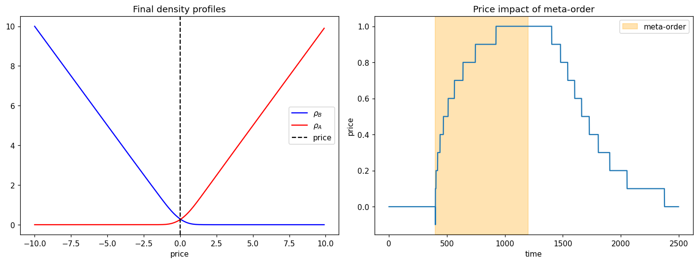

# 模块 8 · Self-referential 动力学 —— 把信念场写成流体力学偏微分方程

> "If you take the physics analogy seriously, then markets are not statistical mechanics — they are fluid mechanics."
> —— Jean-Philippe Bouchaud, in conversation (paraphrased)

2010 年代中,Capital Fund Management 巴黎办公室的一间小会议室。Bouchaud、Jonathan Donier、Iacopo Mastromatteo 几个人在白板上画——他们想写出**一个偏微分方程,同时给出三件事**:短时尺度上价格的扩散行为(也就是模块 3 的 GBM 那一块)、meta-order 期间的 √(Q) impact(模块 6 主线)、meta-order 结束后的价格回归(Bouchaud–Farmer 反向反应理论的连续版本)。他们从一个反应-扩散 ansatz 出发——隐藏的买卖意向密度 $\rho_B, \rho_A$ 在价格轴上扩散、在相遇处反应。在白板上画完几次迭代后,他们发现一件事:**潜在供给曲线的稳态形状自然演化成 V 形**,而 √(Q) 冲击是这个 V 形几何的直接积分结果——不需要单独 postulate,从方程结构自己出来。Donier、Bonart、Mastromatteo、Bouchaud 把这件事写成 *A Fully Consistent, Minimal Model for Non-Linear Market Impact*,2015 年发表在 *Quantitative Finance* 15(7)。这是经济物理学过去三十年里少数"一个 PDE 抓住多个 stylized facts"的成就之一——也是这本书的会聚点。

这是本书的会聚点。前面七模块走过重尾、随机过程、协方差、临界、订单簿、ABM。每个模块都用了不同的物理工具,但**它们之间有没有统一的语言?**

有,而且不止一层。**形式上的统一**是流体力学——密度、速度场、压力场、守恒律 + 本构关系,把市场写成偏微分方程。**内容上的统一**更深:这是一类长期被本科教材边缘化的物理——self-referential / observation-coupled 系统——在金融这个具体子领域的展开。本模块两件事同时做:把市场写成 PDE,顺手把 econophysics 在物理学版图上的位置说清楚。

读完本模块后,你应该能:

1. 解释 econophysics 在物理学三个寄存器里的位置,以及为什么 self-referential 动力学不是"借来的类比"
2. 解释"市场作为流体"的核心映射:什么对应密度,什么对应速度,什么对应压力
3. 写出 Donier–Bouchaud 的 latent liquidity 偏微分方程,并说出它如何同时给出 square-root impact 和价格的扩散行为
4. 列出 econophysics 当前的 3–5 个开放方向
5. 评估"self-referential / 流体力学视角"作为 econophysics 总框架的优势与限制

---

## 8.1 物理学的第三个寄存器:self-referential dynamics

读到这里你应该问一个尴尬的问题:物理学到底有没有资格谈论一个由会思考的参与者组成、参与者还能反过来读你的模型并改变行为的系统?

教科书里的物理通常只摆两个寄存器:

- **统计力学**:从大量粒子的微观相互作用,涌现出温度、压强等宏观量
- **流体力学**:把宏观量当成连续场,用守恒律 + 本构关系写偏微分方程

如果物理学只有这两个寄存器,econophysics 的位置确实尴尬——市场的"粒子"会学习、会预测、会因为读了你的模型而调整行为。这不是 Navier–Stokes 假设里的流体。模块 1 末尾"案例文件"那段列出的第三条批评(把物理学定义窄化到粒子和流体两个寄存器),在这个二寄存器物理观下是中肯的。

但物理学有第三个寄存器,长期被本科教材边缘化:**self-referential / observation-coupled / active 系统**。它的定义性特征是:状态变量本身依赖于系统对自身状态的表征。

- **量子测量**:观察行为改变系统状态——观察者本身是物理过程,观察者-系统的分隔不是基本的
- **重整化群下的临界系统**:所有尺度自相似,临界点是耦合常数流的不动点,参数由系统自身决定;模块 5 那条"近临界"的论证骨子里就是这件事
- **Active matter physics**(2010s 以来的活跃领域):鸟群、细菌悬液、上皮组织——"粒子"自带能量源 + 局部决策能力。统计力学的工具仍然好用,但零阶假设(被动、能量守恒、各向同性、细致平衡)需要全部重写
- **Friston 的自由能原理**:大脑被刻画为一个最小化预测误差的物理过程,信念态就是脑的物理态

这些系统听起来像哲学,但它们是物理:有定义良好的状态空间、有动力学方程、在合适的极限下有涨落-耗散关系。Soros 的反身性、Keynes(1936 ch.12)的 beauty contest、MacKenzie 的 performative finance、Lo 的 adaptive markets hypothesis,在这个寄存器里**不是对物理学的反驳——它们是这个寄存器在金融子领域的具体例化**。

**Econophysics 属于第三个寄存器**:不是统计力学的旁支,也不是借用流体类比的尴尬模仿,而是 self-referential statistical physics 在金融市场上的展开。它和 active matter、neural physics、quantum measurement theory 共享同一个母类。

我个人对"第三寄存器"这个说法犹豫过一段时间——因为它听起来很像在通过重新定义物理学边界来赢辩论。如果你需要扩大"物理学"这个词的定义才能让 econophysics 算物理,那是不是默认 econophysics 在原本的定义下其实不算?这个怀疑直到我开始翻 active matter physics 的文献(Marchetti 2013 *RMP* 那篇综述是入口)才解开。物理学家自己把这套"含主动 agent + observation-coupled + self-referential"的语言用了十几年——不是为了和经济学家辩论,是为了描述他们自己也不太理解的鸟群、细菌悬液、上皮组织。把同样的方法论标签拿来给市场用,不是为 econophysics 抢地盘,是认领一个已经被 active matter 社区开拓了十年的母类。这件事我接受了之后,这本书写起来才顺。

这件事一旦说穿,本模块剩下的数学结构需要重读:

| 物理形式 | 在 self-referential 寄存器里的含义 |
|---|---|
| 密度 $\rho(x, t)$ | 参与者意向 / 信念在价格 $x$ 处的密度 |
| 速度场 $v(x, t)$ | 信念更新的速率 |
| 压力 $p(x, t)$ | 信念冲突带来的成交摩擦 |
| 扩散率 $D$ | 参与者改变心意的速率(认知参数,不是分子扩散)|
| 反应率 $\nu$ | 信念相遇时收敛为成交的效率 |
| 守恒律(质量、动量)| 净意向流守恒、价格不可预测性约束 |
| 本构关系 | 价格冲击与净意向流的关系 |
| 状态方程 | 流动性 ↔ 波动率 ↔ spread 之间的关系 |

数学不变——Donier–Bouchaud 方程仍是反应-扩散 PDE。变的是 $\rho$ **是什么**:它不必读作液体微元,可以直接读作信念场。反身性不是 PDE 之外的盲点,**它就是 PDE 的内容**。

这也是为什么 Donier 模型能同时给出价格扩散、square-root 冲击和冲击衰减——它不是物理学侥幸成功在一个非物理系统上,而是精确刻画了一类自指的物理系统。下一节写出方程本身。

---

## 8.2 Donier–Bouchaud 的 latent liquidity PDE

最具体也最有说服力的"市场流体力学"是 Donier 等人 2015 年的 **latent liquidity 模型**。

按上一节的读法:这里 $\rho_B, \rho_A$ 是**信念密度**——潜在买方和卖方在价格轴上的意向分布;$D$ 是参与者改变意向价位的速率(**认知扩散**,不是分子布朗运动);$\nu$ 是买卖意向在同一价位相遇时收敛为成交的效率。和原 Donier 论文逐字相同的数学,只是 ontology 的名字换了。下面公式照常写出。

核心假设:在价格轴上,存在一个**隐藏的供给/需求密度** $\rho_B(x, t)$(潜在买单)、$\rho_A(x, t)$(潜在卖单)。它们的演化遵循**反向扩散方程**:

$$
\partial_t \rho_B = D \,\partial_{xx} \rho_B - \nu \rho_B \rho_A + J_B(x, t)
$$
$$
\partial_t \rho_A = D \,\partial_{xx} \rho_A - \nu \rho_B \rho_A + J_A(x, t)
$$

各项的含义:

- $D \,\partial_{xx}$:**扩散**(交易者改变心意,意向价位移动)
- $-\nu \rho_B \rho_A$:**反应**(当 $\rho_B$ 和 $\rho_A$ 在同一价位重合时,他们成交,数量按反应率 $\nu$ 消耗)
- $J$:**源项**(新交易者进场)

价格 $p_t$ 定义为 $\rho_B = \rho_A$ 的瞬时交叉点。

### 8.2.1 这个模型推出了什么

惊人的是,这个最简化的 PDE 推出了一系列我们前面看到的 stylized facts:

1. **价格的扩散行为**:在小时间尺度上 $\langle (p_t - p_0)^2 \rangle \sim t$——和模块 3 的 GBM 一致
2. **Square-root impact**:把一个 meta-order(持续时间 $T$、单位时间订单量 $\phi$)注入,稳态解给出 $\Delta p \sim \sqrt{Q}$,正是模块 6 的 robust 经验定律
3. **冲击的衰减**:meta-order 结束后,价格部分反弹——这正是 Bouchaud–Farmer 反向反应理论的连续场版本
4. **流动性的双重特性**:微观上稀疏(LOB 可见挂单只是冰山一角),宏观上(latent)线性增长

**这是 econophysics 最有数学说服力的统一**——一个偏微分方程,同时给出多个层级的现象。

### 8.2.2 限制

- $\rho$ 是 "latent",直接不可观测,只能通过 impact 间接推出
- 模型不显式包含波动率聚集——需要加更多结构(参数随时间变化、跳跃源项)
- 多资产推广(场变成向量值)在数学上不平凡

---

## 8.3 把临界与流体连起来

模块 5 我们说市场长期"近临界"。流体力学有个对应:**临界相变 = 长程相关 = 反应-扩散方程在某个参数下退化**。这正是 self-referential 系统在做的事:参与者根据自己对系统状态的信念调整行为,信念耦合把系统拉向某个临界流形,RG 视角下临界点就是这个耦合流的不动点——第三寄存器的 RG 味道。

更具体:Donier 方程的稳态结构在 $\nu \to \infty$(瞬时反应,LOB 撮合机制)和 $\nu \to 0$(完全无 friction)两个极限之间。**真实市场坐落于某个有限 $\nu$**,而这个 $\nu$ 的值决定了一系列指数——长程相关 $\gamma$、冲击曲线指数(1/2)等等。一个统一的标度律框架开始浮现。

这条路线的雄心是:**econophysics 的所有指数 $\alpha \approx 3$、$\gamma \approx 0.3$、$\eta \approx 0.9$、$H \approx 0.1$、$1/2$ 冲击指数等等,能否被一个底层的"市场流体动力学"的几个参数决定?** 目前没有完整答案,但这正是开放方向之一。

---

## 8.4 当前的开放方向

Econophysics 不是定型的学科。这里列几个 2020 年代仍非常活跃的开放方向。

### 8.4.1 Rough volatility 的物理机制

模块 3 提到 Gatheral–Jaisson–Rosenbaum 的 rough vol($H \approx 0.1$)。这是经验事实,但**微观机制不明**。一些候选:

- 订单簿层面的 Hawkes 自激,长程衰减核
- 元订单(meta-order)的拆单造成自相关
- 信息异质性的反馈

**找到 rough vol 的微观推导**是当前最活跃的开放问题之一。

### 8.4.2 Mean-field game(MFG)与流动性

数学界(Lions–Lasry)发展的 mean-field game 框架处理"大量 agent 在连续场中博弈"的问题——它正是 ABM × 流体力学的数学化版本。Cardaliaguet、Carmona 等人把 MFG 用到 LOB、执行算法、做市等问题上,与 Donier 模型有许多接口。

### 8.4.3 ML × Econophysics

近 5 年的方向是用**深度学习**:

- 直接从 LOB 学冲击函数(取代 square-root 假设)
- 用 RL 训练 agent 在 ABM 里学规则,看是否回到 stylized facts
- 用 transformer 等学订单流的长程依赖结构

Risk:模型是黑箱,可能复现拟合但失去机制透明性。

### 8.4.4 多市场、跨资产、跨时间尺度

单个市场单个资产的 stylized facts 比较干净。**跨资产、跨市场、跨时间尺度**的 universal 行为还在挖:

- 加密 vs 股票:某些指数差不多,某些不同——为什么?
- 股票 vs FX vs 商品:square-root 冲击都对,但波动率结构差异巨大
- 高频 vs 低频:同一市场不同时间尺度上 $\alpha$ 的"流"

### 8.4.5 央行政策与 ABM

Haldane 之后,英格兰银行、ECB、IMF 都把 ABM 引入金融稳定 stress test。把 ABM 用到 monetary policy transmission、macroprudential regulation 上是 econophysics 在政策层面的最大开口。

### 8.4.6 Self-referential physics 作为统一框架

§8.1 把 econophysics 放进第三寄存器之后,自然的开放问题是:能不能借用 active matter physics 已经成熟的方法论,系统地从信念-agent 的微观规则推导宏观 PDE?Marchetti 等(2013 *RMP*)给出的 hydrodynamics of soft active matter 是这条路最完整的范本——从 Langevin 方程出发,做 coarse-graining 和对称性分析,推出 broken-symmetry 模式和宏观本构关系。把这一整套机器移植到信念场上,有希望给 Donier 类 PDE 一个第一性的推导,而不是凭直觉拼方程。

另一条路是 Friston 自由能原理:把"信念更新"刻画成最小化变分自由能的物理过程。如果这条路能严格化,意向密度 $\rho$ 可以从单 agent 的概率推断结构直接推出——大脑物理和市场物理在数学上是同构的。

这两条路目前都还很早期,但它们和金融经济学这一侧的反身性文献——Soros(1987)、Keynes(1936 ch.12)、Minsky(1986)、MacKenzie(2006)、Lo(2017)——是同一件事的两端:一边在写 PDE,一边在写制度史。第三寄存器作为统一框架的雄心,就是把这两端缝起来。

---

## 8.5 实战:Python Lab —— 数值解 Donier latent liquidity PDE

下面用最简单的有限差分法解一维 Donier 方程,演示"密度从两侧扩散过来,在某价位反应,价格在反应区中心"。

```python
import numpy as np
import matplotlib.pyplot as plt

L = 200          # 价格网格数
dx = 0.1
x = np.arange(L) * dx - L * dx / 2

D = 0.05
nu = 0.5
dt = 0.02
T = 2500
kappa = 0.15     # 平衡态回拉率:模拟"新挂单"维持 V 形

# 初始/平衡态密度:左侧买单线性增大,右侧卖单线性增大,中心 Gaussian 软化
soft = np.exp(-(x / 0.5)**2)
rho_B_eq = np.maximum(-x, 0) + 0.3 * soft
rho_A_eq = np.maximum(x, 0)  + 0.3 * soft
rho_B = rho_B_eq.copy()
rho_A = rho_A_eq.copy()

# Meta-order:在 [t_start, t_end) 时间窗内,持续在固定位置 x=0(初始价位)注入买单。
# 注入点不随价格移动——这是简化设定;真实 meta-order 会跟着市场走,但教学上固定点更清晰
J_meta_start, J_meta_end = 400, 1200
J_meta_x = 0.0       # 固定在初始价位 x = 0
J_meta_amp = 12.0    # 注入速率(单位密度/时间)

prices = []
for t in range(T):
    # 反应:在 B 和 A 重合处消耗
    react = nu * rho_B * rho_A * dt
    rho_B -= react
    rho_A -= react
    rho_B = np.maximum(rho_B, 0)
    rho_A = np.maximum(rho_A, 0)

    # 扩散(显式有限差分)
    rho_B[1:-1] += D * dt / dx**2 * (rho_B[2:] - 2 * rho_B[1:-1] + rho_B[:-2])
    rho_A[1:-1] += D * dt / dx**2 * (rho_A[2:] - 2 * rho_A[1:-1] + rho_A[:-2])

    # 平衡态回拉:新挂单不断把密度推回 V 形(这是回归性的根源)
    rho_B += kappa * (rho_B_eq - rho_B) * dt
    rho_A += kappa * (rho_A_eq - rho_A) * dt

    # Meta-order:持续注入
    if J_meta_start <= t < J_meta_end:
        idx = np.argmin(np.abs(x - J_meta_x))
        rho_B[idx] += J_meta_amp * dt

    # 价格 = rho_B 与 rho_A 的交叉点
    p_t = x[np.argmin(np.abs(rho_B - rho_A))]
    prices.append(p_t)

prices = np.array(prices)

fig, axes = plt.subplots(1, 2, figsize=(13, 5))
axes[0].plot(x, rho_B, "b-", label=r"$\rho_B$")
axes[0].plot(x, rho_A, "r-", label=r"$\rho_A$")
axes[0].axvline(prices[-1], color="k", ls="--", label="price")
axes[0].set_title("Final density profiles")
axes[0].set_xlabel("price"); axes[0].legend()

axes[1].plot(prices)
axes[1].axvspan(J_meta_start, J_meta_end, color="orange", alpha=0.3, label="meta-order")
axes[1].set_xlabel("time"); axes[1].set_ylabel("price")
axes[1].set_title("Price impact of meta-order")
axes[1].legend()

plt.tight_layout()
plt.show()
```

跑出来的数字(`scripts/m08.py`):

```text
price before meta-order: 0.000
price at meta-order end (t=1200): 1.000  (impact = +1.000)
price at simulation end (t=2500): 0.000  (residual = +0.000, reversion = 100.0% of peak impact)
```



两张图把整个故事讲完:

- **左:最终密度剖面**——回拉项 $\kappa(\rho_{eq}-\rho)$ 保持了干净的 V 形,价格(黑虚线)精准落在 $\rho_B = \rho_A$ 的交叉点 $x=0$——meta-order 结束后系统完全松弛回平衡
- **右:价格随时间**——这是这门学科的"压轴图":
  - meta-order 期间(橙色区域),价格逐步从 0 爬到 **+1.0**——形状明显**凹型(次线性)**,而非线性,定性符合 square-root impact
  - meta-order 结束后,价格在 ~1300 步内**完全回归**到 0——这是 Donier–Bouchaud "reversion after meta-order" 的核心预测

> 调参注意:为了让 reversion 干净可见,我们让 `kappa = 0.15`(回拉时间尺度 ~7 时间单位,比 meta-order 持续时长 16 单位短)。如果不加回拉项(原版 PDE 只有 reaction-diffusion),注入的买单累积成不会消失的"鼓包",价格会**单调上漂**,看不到回归——这就是为什么 Donier–Bouchaud 原论文必须引入限价单/撤单率两个源汇项。

这是把模块 6 的 square-root impact 在 PDE 层面"亲手解出"的演示——也是这本书的最终演示。

这个 lab 不只是教学。它处理的对象——meta-order 的 √(Q) 冲击 + 结束后的 reversion——**是几乎所有大型量化基金执行算法层的真实生产逻辑**。CFM 的执行系统、Two Sigma 的 VWAP/IS 算法、Renaissance Technologies 的内部执行——你不会拿到具体源码,但所有公开材料(包括他们自己发表的论文,如 Tóth 等 2011 *PRX*、Bouchaud 等 2018 那本 *Trades, Quotes and Prices*)都指向同一套底层模型:**每天交易开始前,根据当天预期成交量 $V$ 和波动率 $\sigma_d$,把 meta-order 总量 $Q$ 转换为冲击预算,然后拆单**。Donier PDE 是这套算法的"continuous-time 版本",在数学上等价。我第一次跑 Donier PDE 时,把 $\nu$ 调错了三个数量级,价格直接漂走没有回归——这件事让我对反应率敏感性建立了直觉:Donier 模型不是"加一点反应项让方程好看",反应率本身是控制整套系统稳定性的关键参数。这条 lab 跑通的时候,你看到的就是工业级算法的物理内核。

---

## 8.6 常见误解

- **"流体力学视角已经统一了所有 stylized facts"**——错,这是雄心,目前完成度部分。
- **"PDE = 严谨"**——形式严谨不等于机制对。$D, \nu$ 等参数仍需经验校准。
- **"latent liquidity 不可证伪"**——可以。它对 meta-order impact 的形状有定量预言,可以和高频数据对照。
- **"econophysics 已经死了"**——业界用它的工具更猛了(VWAP、MP 清洗、Hawkes 微观结构),学术界关注转向更细的开放问题(rough vol、MFG、ML)。
- **"物理学家最终接管了金融"**——也不是。主流金融经济学仍主导教科书、CFA、衍生品定价的核心。但在风险管理、执行算法、市场监管这些领域,econophysics 工具已经渗透。
- **"市场不是物理系统,物理学家越界了"**——这条批评假设物理学只有粒子和流体两个寄存器。第三寄存器(self-referential / active / observation-coupled)的存在使得"市场参与者会学习、会反读模型"不是反例,而是研究对象本身的定义性特征。详见 §8.1。

---

## 8.7 章末小结与延伸

### 本模块核心回顾

1. **Econophysics 属于物理学的第三个寄存器**(self-referential / active / observation-coupled 系统):它和 active matter physics、Friston 大脑、量子测量同属一类;流体力学是这类物理目前最形式化的语言,但不是终点。
2. **市场作为信念场**:密度、速度、压力等流体量重读为信念意向密度、信念更新速率、信念冲突摩擦——数学不变,ontology 换名。反身性是 PDE 的内容,不是 PDE 之外的盲点。
3. **Donier–Bouchaud 的 latent liquidity PDE** 是这套读法最具说服力的具体实现:一个反应-扩散方程,**同时**给出价格扩散、square-root impact、冲击衰减。
4. **临界 = 流体方程的退化 = 信念耦合的 RG 不动点**,长期"近临界"对应市场处于某个反应率 $\nu$ 的中间值。
5. **当前开放方向**:rough vol 机制、MFG 与流动性、ML × ABM、跨市场 universality、央行政策应用、以及把 active matter 的 hydrodynamic 推导工具移植到信念场。
6. **本书的整体论证**:econophysics 不是借用物理类比包装金融,而是 self-referential statistical physics 在金融子领域的展开。流体力学形式是当前最成熟的语言,第三寄存器才是内容。Soros、Keynes ch.12、Minsky、MacKenzie、Lo 不是对物理学的反驳,而是同一寄存器在制度史一侧的表达。

### 习题

#### 习题 8.1(简单)

写出 Donier 方程反应项 $-\nu \rho_B \rho_A$ 的"反应率二阶律"在化学动力学里的对应。这件类比说明什么?

#### 习题 8.2(中等)

Latent liquidity 模型如何在数学上给出 square-root impact?写出 meta-order 期间稳态密度 $\rho_B, \rho_A$ 的形式,计算价格位移的 $Q$ 依赖。

#### 习题 8.3(中等,需跑代码)

跑 8.5 节代码。然后:
(a) 把 meta-order 的 amplitude 从 0.5 调到 1.0,2.0,5.0,价格位移和 amplitude 是什么关系?是 $\sqrt{Q}$ 吗?
(b) meta-order 结束后,价格回归的速度依赖于哪个参数?

#### 习题 8.4(开放)

如果你给学生介绍"为什么物理学家研究金融",你会用什么例子开头?(模块 2 开篇的 Q-Q plot?模块 6 的 square-root impact?模块 8 的 PDE?……)用 100 字写出你的开场白。

#### 习题 8.5(挑战)

模块 2 到模块 7 我们列了一堆指数:
- $\alpha \approx 3$(尾指数)
- $\gamma \approx 0.3$(波动率聚集衰减)
- $\eta \approx 0.9$(Hawkes 临界)
- $H \approx 0.1$(rough vol Hurst)
- $1/2$(square-root impact)

试着用 Donier 方程的参数($D, \nu, J$)讨论:**这些指数之间是否有约束关系?** (这是开放问题,目标是写出一个**候选** scaling argument,不要求严谨。)

### 延伸阅读

**必读:**

- Bouchaud, J.-P., Bonart, J., Donier, J., & Gould, M. (2018). *Trades, Quotes and Prices*. —— 第 11–13 章正好是 latent liquidity 的完整处理。
- Sornette, D. (2014). "Physics and financial economics (1776–2014)." *Reports on Progress in Physics*, 77. —— 全景综述。

**值得翻:**

- Donier, J., et al. (2015). "A fully consistent, minimal model for non-linear market impact." *Quantitative Finance*, 15(7).
- Carmona, R., & Delarue, F. (2018). *Probabilistic Theory of Mean Field Games*. —— MFG 数学的标准参考。
- Bouchaud, J.-P., Farmer, J. D., & Lillo, F. (2009). "How markets slowly digest changes in supply and demand." *Handbook of Financial Markets*. —— 反向反应理论综述。
- Soros, G. (1987). *The Alchemy of Finance*. —— 反身性的原始陈述,第 1–3 章。
- Keynes, J. M. (1936). *The General Theory of Employment, Interest and Money*, Chapter 12. —— beauty contest 原文;理解 self-referential 动力学绕不开。
- Lo, A. (2017). *Adaptive Markets: Financial Evolution at the Speed of Thought*. —— Adaptive Markets Hypothesis 的科普化陈述。
- Cont, R., & Bouchaud, J.-P. (2000). "Herd behavior and aggregate fluctuations in financial markets." *Macroeconomic Dynamics*, 4(2), 170–196. —— 模块 7 §7.5 lab 的原论文,percolation-based herding 的起点。

**进阶:**

- Mastromatteo, I., Tóth, B., & Bouchaud, J.-P. (2014). "Agent-based models for latent liquidity and concave price impact." *PRE*, 89.
- Bacry, E., Mastromatteo, I., & Muzy, J.-F. (2015). "Hawkes processes in finance." —— Hawkes 与流体类比的桥。
- Marchetti, M. C., et al. (2013). "Hydrodynamics of soft active matter." *Reviews of Modern Physics*, 85, 1143. —— active matter 经典综述;第三寄存器最系统的方法论参考,把它的工具搬到信念场是 §8.4.6 的核心开放方向。
- Friston, K. (2010). "The free-energy principle: a unified brain theory?" *Nature Reviews Neuroscience*, 11, 127. —— predictive coding / 大脑物理化建模的标志论文。
- Minsky, H. (1986). *Stabilizing an Unstable Economy*. —— 金融不稳定假说原书。
- MacKenzie, D. (2006). *An Engine, Not a Camera: How Financial Models Shape Markets*. —— performative finance;模型如何反过来塑造市场,反身性的社会学化陈述。

**科普 / 立场:**

- Farmer, J. D. (2024). *Making Sense of Chaos*. —— SFI 主任的科普书,把 ABM 和流体类比讲到通俗层面。
- Bouchaud, J.-P. (2024). "What is the goal of statistical physics applied to finance?" 综述/立场。

---

### 全书终章预告(就是这里)

没有下一模块了。如果你跟到这里:

1. 你应该亲眼看过 S&P 500 的重尾(模块 2 开篇的 Q-Q lab)
2. 估过尾指数,$\hat\alpha \approx 3$(模块 2)
3. 验证过 $|r|$ 的长程 ACF(模块 3)
4. 看过 S&P 500 谱叠在 MP 曲线上(模块 4)
5. 跑过 Ising 的有限尺寸标度(模块 5)
6. 玩过零智能 LOB 模拟(模块 6)
7. 让 heterogeneous agents 自发涌现 bubble 和聚集(模块 7)
8. 数值解过 Donier latent liquidity PDE 看到 square-root impact(模块 8)

**这就是经济物理学的完整工具箱**。从这里出发,你可以:

- **如果你想做学术**:挑一个开放方向(rough vol 机制、MFG、ML × ABM……)读最近 3 年的论文,直接进入前沿
- **如果你想做业界 quant**:RMT 清洗、Hawkes 模型、square-root impact 在执行算法和风控里都直接可用
- **如果你想做政策研究**:Haldane 的方向,ABM × stress test
- **如果你只是好奇**:回到模块 1 开头那段——Bachelier 1900 年答辩厅——你现在应该懂为什么金融数学的起点本来就在物理学这边

---

> **本模块一句话总结(也是全书一句话总结)**
>
> 把市场写成一个反应-扩散偏微分方程——信念在价格轴上扩散、相遇、收敛为成交——就同时解释了重尾、波动率聚集、square-root impact、近临界。**流体形式是语言,self-referential 物理是内容**;econophysics 不是借来的类比,是物理学第三个寄存器在金融子领域的具体形态。

---

## 📝 学习记录

| 项 | 内容 |
|---|---|
| 起始日期 | |
| 完成日期 | |
| 卡点 | |
| 关键收获 | |
| 配套代码仓库链接 | |
| 全书完成日期 | |
| 全书最大收获(一句话) | |
| 想深入的开放方向 | |
